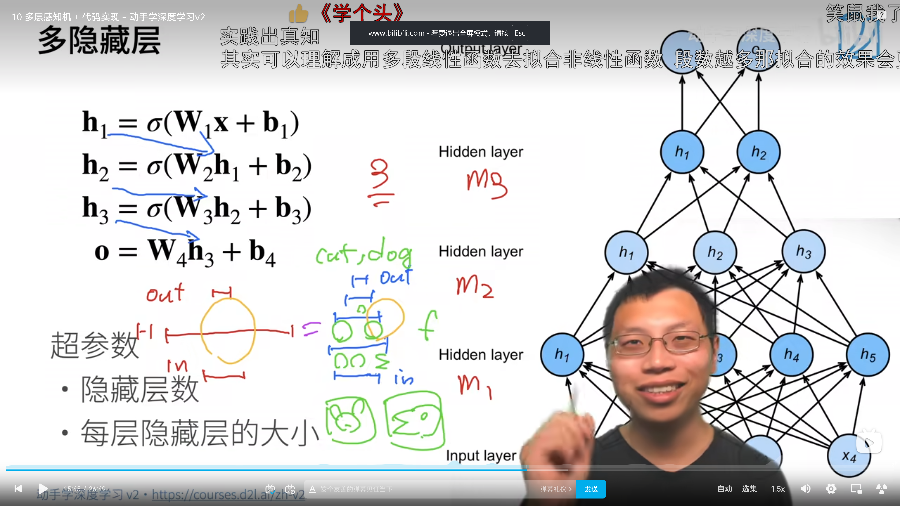

# 多层感知机 (MLP) 核心解析：维度变换与 ReLU 魔法

多层感知机（Multi-Layer Perceptron，MLP）是迈向大模型（Transformer）的最后一块基础拼图。在未来要学习的大模型（Transformer 架构）中，除了 Attention 机制之外，剩下的大部分代码核心几乎都是 MLP！在大模型应用中，它通常被称为**前馈网络 (FeedForward Network, FFN)**。

本文将用软件工程的数据流（Data Flow）视角，解析 MLP 的层间维度转化，以及为什么 **ReLU 激活函数**是整个神经网络实现非线性的灵魂。

## 1. 核心理念的软工翻译

### 1.1 层间转化：维度的连环魔法
很多同学在学习神经网络时容易被复杂的张量乘法绕晕，其实最关键的切入点是聚焦于**形状（Shape）**。一层神经网络，本质上就是一个用矩阵运算改变数据形状的函数。

以 Fashion-MNIST 图像分类为例，我们需要把 `28x28=784` 像素的图片分类到 10 个类别中。当我们不仅限于直接映射，而是引入一个大小为 256 的**隐藏层 (Hidden Layer)** 时，层间转化的过程如下：

1. **输入数据 X**：形状是 `(BatchSize, 784)`
2. **第一网络层（权重 W1）**：形状设定为 `(784, 256)`
   * **转化过程**：`X @ W1` （矩阵乘法）
   * **结果形状变为**：`(BatchSize, 256)`。此时的物理含义是，784 个原始像素点被揉碎并重新组合成了 256 个更为抽象的高级特征。
3. **第二网络层（权重 W2）**：形状设定为 `(256, 10)`
   * **转化过程**：`H @ W2`
   * **结果形状变为**：`(BatchSize, 10)`。这 256 个高级特征最终在此层向 10 个分类进行结果投票。

** 软工视角**：层与层之间的转化，就像是流水线上前后相连的微服务。第一个微服务吃进去 784 个字段的 JSON，吐出 256 个字段的 JSON；第二个微服务吃进去 256 个，吐出 10 个。只要它们的**接口（也就是维度）对得上**，你想串联多少层微服务进行加工都可以！

### 1.2 为什么必须有 ReLU 激活函数？
如果只做矩阵乘法（`H = X @ W1`, `O = H @ W2`），从数学上来看 `O = X @ (W1 @ W2)`。由于两个矩阵相乘还是一个新矩阵 `W3`，公式可以简化为 `O = X @ W3`。
这就是所谓的线性塌陷。如果没有激活函数进行干预，无论你在中间堆叠 100 层还是 1000 层，它在数学上都会**等价于单层的线性回归**。这种网络只能画出直线，彻底丧失了处理复杂非线性逻辑的能力。

**ReLU 激活函数**拯救了这一切：
```python
def relu(X):
    return torch.max(X, 0)
```
就是这句极简的代码（把所有负数强行归 0，正数原样保留），强制打断了线性的顺滑传递：
1. `H = X @ W1 + b1` -> 执行线性转化。
2. `H = relu(H)` -> **非线性打断！通过折叠或截断特征（负数清零）引入非线性空间**。
3. `O = H @ W2 + b2` -> 再次进行线性转化。

因为 `relu` 的存在，`W1` 和 `W2` 永远无法再被简单合并。只要这样的中间层足够宽、层数足够深，根据通用近似定理，它就能拟合出任何复杂的边界和曲线。

### 1.3 LLM 面试加分项：大模型中的 MLP (FFN)
在 GPT 等大型语言模型中，MLP (FFN) 往往采用非常经典的**升维再降维**结构套路：
1. 网络接收来自上一层的文本字词向量（例如初始维度为 768）。
2. 先通过类似于 `nn.Linear(768, 3072)` 的全连接层把维度放大约 4 倍，并伴随一个激活函数（如 GELU）。
3. 再通过 `nn.Linear(3072, 768)` 将其缩小回 768 维。

**为什么要膨胀再缩小？**
学术界与业界的普遍共识是：这构成了大模型的**知识记忆库**。中间膨胀放大的 3072 维高维空间，主要用于充分死记硬背海量的世界知识规律；而缩回 768 维，则是为了紧紧与 Attention（注意力）机制的接口对齐，保证网络模块可以像搭积木般深度堆积。

---

## 2. 从零实现 MLP 代码实战

我们将继续使用 Fashion-MNIST 数据集进行测试。

```python
import torch
from torch import nn
from d2l import torch as d2l

batch_size = 256
train_iter, test_iter = d2l.load_data_fashion_mnist(batch_size)
```

### 2.1 初始化模型参数
为了实现具有单隐藏层（256 个隐藏单元）的 MLP，我们需要为第一层和第二层分别声明权重矩阵与偏置向量。

```python
num_inputs, num_outputs, num_hiddens = 784, 10, 256

# W1形状: (784, 256)。负责将输入转化至隐藏层维度
W1 = nn.Parameter(torch.randn(num_inputs, num_hiddens, requires_grad=True) * 0.01)
b1 = nn.Parameter(torch.zeros(num_hiddens, requires_grad=True))

# W2形状: (256, 10)。负责将隐藏层特征转化为最终类别输出
W2 = nn.Parameter(torch.randn(num_hiddens, num_outputs, requires_grad=True) * 0.01)
b2 = nn.Parameter(torch.zeros(num_outputs, requires_grad=True))

params = [W1, b1, W2, b2]
```

### 2.2 实现 ReLU 激活函数和模型前向传播

```python
# 1. 激活函数：负数置零，正数保留
def relu(X):
    a = torch.zeros_like(X)
    return torch.max(X, a)

# 2. 模型前向传播定义
def net(X):
    # 将批量二维的图像强行展平为二维矩阵 (BatchSize, 784)
    X = X.reshape((-1, num_inputs))
    # 线性转化 @ 代表矩阵乘法，随后紧跟 relu 切断纯线性映射
    H = relu(X @ W1 + b1)  
    # 返回最后的输出层结果
    return (H @ W2 + b2)
```

### 2.3 高级 API 的工程模式对比
如果是实战开发，使用 PyTorch 高级 API 的 `nn.Sequential` 相当于直接调用了设计模式里的责任链模式（Pipeline）。上面的纯手工代码等价于：
```python
net_concise = nn.Sequential(
    nn.Flatten(),
    nn.Linear(784, 256),
    nn.ReLU(),
    nn.Linear(256, 10)
)
```

### 2.4 定义损失函数与训练
这里一如既往地采用内置的 `CrossEntropyLoss`（其内部封装了 LogSumExp，用来防范数值溢出），训练调用流程与 Softmax 回归一致。

```python
loss = nn.CrossEntropyLoss(reduction='none')

num_epochs, lr = 10, 0.1
# 使用 SGD 优化器
updater = torch.optim.SGD(params, lr=lr)

# 调用 d2l 提供的训练函数
d2l.train_ch3(net, train_iter, test_iter, loss, num_epochs, updater)
```

---

## 3. 全局小结
1. **维度变换是结构核心**：模型一层层传递，实际上就是寻找规律并进行矩阵形状 (`Shape`) 的连环转化。
2. **ReLU 是灵魂**：没有非线性的激活函数作为关卡，再深的网络也只会退化和塌陷成一层的线性回归。
3. **架构的流水线**：利用 `nn.Sequential` 能够优雅和高内聚地管理输入和输出维度对齐的模块。

---

## 4. 常见疑问（Q&A）

**1. 为什么深度学习倾向于增加隐藏层的层数（变深），而不是一味增加单层的神经元个数（变宽）？**
> 单纯依靠极度宽大的单隐层虽然在理论上也能拟合任意函数，但效率极低，而且由于权重都在同一层被更新，往往容易发生严重的 **过拟合 (Overfitting)**。
> 而增加网络的层数，能促使模型进行 **层次化特征表示 (Hierarchical Feature Representation)**的自主学习。像图像识别任务，浅层（前面几层）可以学习到线条、边缘等基础纹理，中层能够组合成耳朵、脚掌等部件，深层则将这些部件融合成类似猫的整体语义概念。这种深而窄的网络架构，能有效分摊学习压力，所需参数量更少且泛化能力更强。


**2. 在不同任务和模型中，究竟该如何选择各种不同的激活函数（ReLU, Sigmoid, Tanh 等）？**
> 实际上，在现在的深度学习实践中，针对**中间隐藏层**，**ReLU 及其变种（LeakyReLU, GELU 等）是绝对优先的工业标准**。
> 原因是：ReLU 计算成本极低（甚至避开了复杂的次幂运算），且它在正数区间导数恒为 1，完美击破了深度网络中可怕的**梯度消失 (Vanishing Gradient) 问题**。
> 至于 Sigmoid 或 Softmax，更多是被放置在网络的最后输出层用作概率的归一转换操作。总的来说，模型结构的调优（例如架构从 784->64->10 改为 784->128->32->10）往往比纠结于不同的现代激活函数能带来大得多的性能差异。
