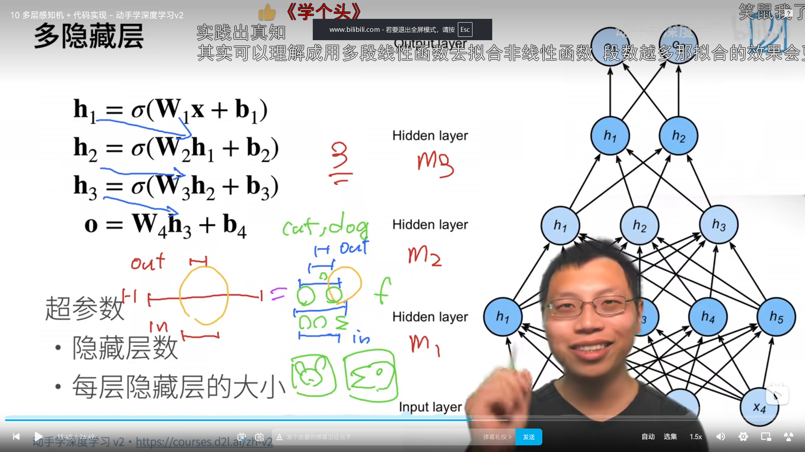

# 多层感知机：维度变换与非线性

多层感知机（Multi-Layer Perceptron，MLP）可以看成若干线性层与非线性激活的交替组合。它比 Softmax 回归多出的关键一步，是先把输入映射到隐藏表示，再用这个表示完成预测。

Transformer 中也有逐 token 的前馈网络（FFN）。它和这里的 MLP 共享“线性层—激活—线性层”的结构，但具体激活、门控方式和宽度会因模型而异。

## 1. 先看张量形状

Fashion-MNIST 的单张图像为 (28\times28)，展平后有 784 个特征。设隐藏层宽度为 256，输出为 10 个类别：

```text
(B, 1, 28, 28)
      ↓ Flatten
(B, 784)
      ↓ Linear(784, 256)
(B, 256)
      ↓ ReLU
(B, 256)
      ↓ Linear(256, 10)
(B, 10)
```

对应公式是

$$
H=\operatorname{ReLU}(XW_1+b_1),
$$

$$
O=HW_2+b_2.
$$

隐藏维度 256 是需要实验选择的超参数。它不是“256 种人能理解的高级特征”；单个通道的意义通常依赖整个网络和数据。

## 2. 为什么中间需要激活函数

如果去掉 ReLU：

$$
H=XW_1+b_1,
$$

$$
O=HW_2+b_2
=X(W_1W_2)+(b_1W_2+b_2).
$$

多层仿射变换仍可合并成一层仿射变换。堆更多线性层不会增加可表示的函数类别，只会换一种参数化方式。

ReLU 定义为

$$
\operatorname{ReLU}(x)=\max(x,0).
$$

它在不同输入区域选择不同的线性分支，使整个网络成为分段线性函数。深度和宽度越大，模型能组合出的分段结构通常越丰富，但训练效果仍取决于数据、优化和正则化。

## 3. 从零写一个单隐藏层 MLP

```python
import torch
from torch import nn
from d2l import torch as d2l

batch_size = 256
train_iter, test_iter = d2l.load_data_fashion_mnist(batch_size)

num_inputs = 784
num_hiddens = 256
num_outputs = 10

W1 = nn.Parameter(torch.randn(num_inputs, num_hiddens) * 0.01)
b1 = nn.Parameter(torch.zeros(num_hiddens))
W2 = nn.Parameter(torch.randn(num_hiddens, num_outputs) * 0.01)
b2 = nn.Parameter(torch.zeros(num_outputs))
params = [W1, b1, W2, b2]
```

```python
def relu(X):
    return torch.maximum(X, torch.zeros_like(X))


def net(X):
    X = X.reshape(-1, num_inputs)
    H = relu(X @ W1 + b1)
    return H @ W2 + b2
```

偏置形状分别为 `(256,)` 和 `(10,)`。与 batch 矩阵相加时，PyTorch 会沿 batch 维广播。这里的输出仍是 logits，交给交叉熵处理。

```python
loss_fn = nn.CrossEntropyLoss(reduction="none")
optimizer = torch.optim.SGD(params, lr=0.1)
d2l.train_ch3(net, train_iter, test_iter, loss_fn, 10, optimizer)
```

## 4. 用 `nn.Sequential` 表达同一个结构

```python
net_concise = nn.Sequential(
    nn.Flatten(),
    nn.Linear(784, 256),
    nn.ReLU(),
    nn.Linear(256, 10),
)
```

`Sequential` 适合单输入、单输出并按顺序连接的网络。出现残差、多分支、多个输入或中间状态复用时，继承 `nn.Module` 并手写 `forward` 会更清楚。

## 5. MLP 在 Transformer 里做什么

attention 负责 token 之间的信息混合，FFN 则对每个 token 独立使用同一组参数做通道变换。一个基础形式是：

$$
\operatorname{FFN}(x)=W_2\,\sigma(W_1x+b_1)+b_2.
$$

中间维度经常大于 (d_{model})，目的是增加逐位置非线性变换的容量。现代模型还常见 GELU、SiLU、SwiGLU 等激活或门控结构。把 FFN 解释成“知识存储”是一种研究视角，不应当成每个神经元都对应明确事实的字典。

## 6. 深度和宽度怎么理解

通用近似定理说明，在一定条件下，足够宽的单隐藏层网络能够逼近广泛的连续函数；它没有告诉我们有限数据下哪种结构更容易训练，也没有保证泛化。

实践中：

- 增加宽度会直接增加单层参数和计算；
- 增加深度能逐层组合特征，但优化更难；
- residual、normalization 和合适初始化让深层网络更容易训练；
- 结构选择应通过验证集和资源约束判断，不能只靠“越深越好”。

对图像来说，MLP 展平像素后忽略了二维局部结构。CNN 用卷积加入局部性和平移共享，ViT 则先把图像划为 patch，再用 attention 建模 patch 之间的关系。



## 7. 几个调试检查

1. 在每层后打印 shape，先排除维度错位；
2. 确认最后一层没有提前加 softmax，`CrossEntropyLoss` 接收 logits；
3. 观察 ReLU 输出中 0 的比例，长期全为 0 的单元可能没有有效梯度；
4. 同时看训练集和验证集：两边都差通常是欠拟合或优化问题，只有验证集变差才更像过拟合；
5. 比较参数量与数据量，增加隐藏层并不自动带来更好的测试表现。

我目前用一句话记 MLP：线性层负责重新组合特征，激活函数让不同输入走不同的线性区域。先沿着 shape 把数据流看明白，再谈网络到底学到了什么。
