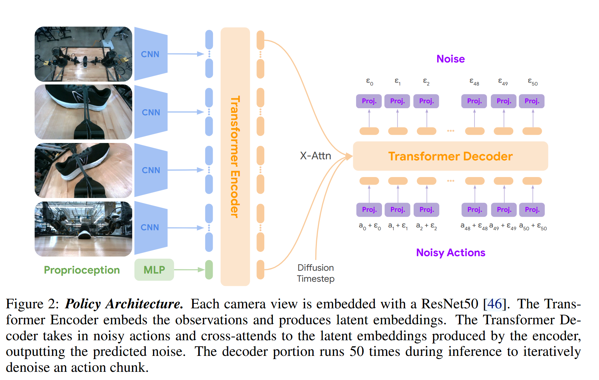
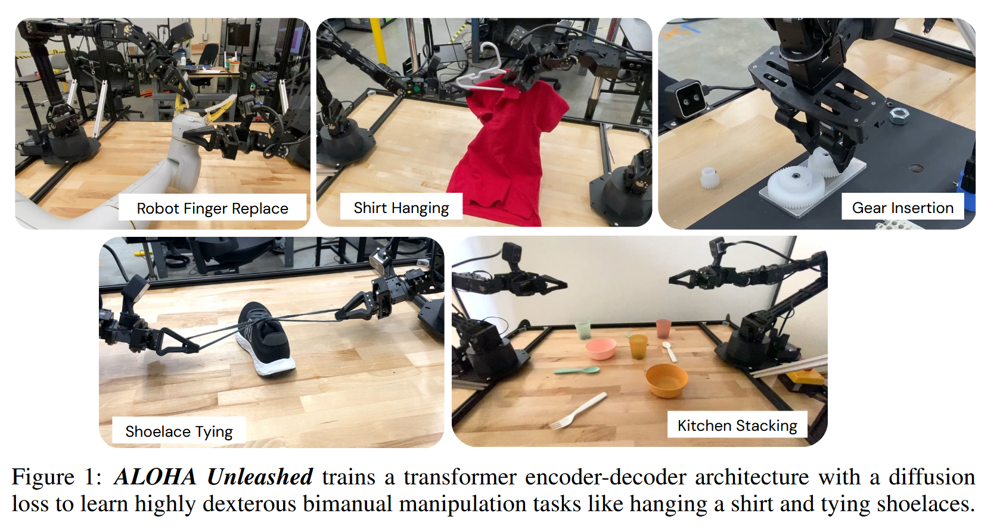

# ALOHA Unleashed：A Simple Recipe for Robot Dexterity

## 一、论文对应的 Task 是什么？

### 1. 任务定义

论文研究的是双臂机器人的灵巧操作任务：机器人需要在真实环境中协调两条机械臂，完成包含可变形物体、复杂接触、精密插入和长时序操作的任务。

这不是普通的抓取或放置。一个任务通常包含多个连续阶段，而且前一步的结果会改变后续状态。例如挂衣服需要依次整理衣服、取下衣架、双手传递衣架、将衣架插入领口，最后再把衣服挂回架子。

### 2. 具体场景与任务目标

| 场景 | 初始状态 | 目标输出（最终物理状态） |
| --- | --- | --- |
| `Shirt Hanging` | 衣服平放或随机旋转、起皱、偏离中心，衣架位于架子上 | 衣架正确穿入领口，衣服被挂回架子 |
| `Shoelace Tying` | 鞋和鞋带处于不同位置、角度与凌乱程度 | 鞋被摆正，鞋带被整理并打成蝴蝶结 |
| `FingerReplace` | 机器人手指及替换件位于工作区 | 旧手指被拆下，替换件以毫米级精度插入卡槽 |
| `GearInsert` | 3 个齿轮位于桌面，轴和相邻齿轮固定 | 3 个齿轮依次压入轴中并正确啮合 |
| `RandomKitchen` | 碗、杯子和餐具随机散落 | 物品被堆叠并放到桌面中央 |
| 仿真任务 | 插销、插座、杯子和盘子随机初始化 | 完成单端插入、双端插入或把杯子放到盘子上 |

### 3. 实际任务的输入与输出

这里要区分“实际任务”和“模型”。实际任务的输入是一个处于随机初始状态的物理工作区，包括衣服、鞋带、齿轮等对象及其位置和形态；任务执行过程中，机器人持续获得环境和自身状态的反馈。实际任务的输出不是一个数值向量，而是满足要求的最终物理状态，例如衣服成功挂起、鞋带打结或齿轮完全插入。

模型层面的输入输出将在第五部分说明。

### 4. 研究意义

系鞋带、整理衣物和精密装配都需要双臂协调、连续决策和接触控制。传统方案通常依赖精确硬件、力传感器、动力学模型或为单个任务专门设计的控制流程。本文希望验证：能否使用相对低成本、精度有限的 ALOHA 2，仅依靠大规模真人演示和端到端模仿学习获得复杂技能。这条路线若成立，可以降低机器人技能开发中建模和手工编程的成本。

## 二、这个任务有哪些数据集，本文采用了什么数据集？

### 1. 数据来源

本文没有直接使用一个现成的通用灵巧操作数据集，而是针对每项任务自行采集演示数据。真实数据在 ALOHA 2 平台上通过双臂遥操作采集；仿真数据也由人操作仿真环境获得。

真实数据的总体规模如下：

- 35 名非专家操作员；
- 10 台 ALOHA 2，分布在 2 栋建筑中；
- 连续采集 8 个月；
- 5 个真实任务共 26,241 条演示；
- 3 个仿真任务共 2,000 余条演示。

| 真实任务数据集 | 演示数量 | 构成 |
| --- | ---: | --- |
| Shirt | 8,658 | 5,345 条 Easy，3,313 条 Messy |
| Lace | 5,133 | 2,212 条 Easy，2,921 条 Messy |
| FingerReplace | 5,247 | 单一任务设置 |
| GearInsert | 4,005 | 连续插入 3 个齿轮 |
| RandomKitchen | 3,198 | 其中 216 条来自测试所用机器人 |

### 2. 一条数据包含什么

一条数据是一次完整的遥操作轨迹（episode），可以写成时序序列：

$$
\tau=\{(o_t,a_t)\}_{t=1}^{T}
$$

其中，$o_t$ 包含同一时刻 4 个视角的 RGB 图像和机器人的本体状态；$a_t$ 是操作者通过 leader arms 给出的双臂动作，包括两条 6-DoF 机械臂的 12 个关节目标以及两个夹爪位置，共 14 维。轨迹中没有人工标注的“整理衣服”“拿衣架”等阶段标签，模型需要直接从动作序列中学习阶段切换。

### 3. 数据如何构造

作者为每个任务编写统一的操作规范。新操作员先采集 5～10 条测试轨迹，由研究人员检查质量；对于 `ShirtMessy` 和系鞋带等困难任务，还会进行简短的现场教学。通过这套流程，非专家操作员能够在研究人员不全程监督的情况下持续采集数据。

数据来自不同操作员、机器人、建筑、光照条件和硬件状态，因此同时包含：

- 同一任务的多种合理操作策略；
- 相机和机械臂安装位置的差异；
- 硬件磨损、背景和光照变化；
- 操作中的调整、失败恢复与重试。

论文没有完全清洗掉这些差异。主模型直接使用具有真实噪声和多模态策略的数据训练，而数据过滤只在消融实验中研究。

## 三、已有工作是如何解决这个 Task 的？

### 1. 传统或专用方案

已有双臂灵巧操作工作常从优化、运动规划、动力学建模、关键点或运动基元出发。这类方法在已知环境动力学、物体状态较容易估计或任务流程固定时有效，但面对衣服这类可变形物体、复杂摩擦接触和长任务链时，建立准确模型与专用控制器的成本很高。有些高精度成果还依赖手术机器人等昂贵、精密的平台，难以直接迁移到低成本硬件。

### 2. 主要 Baseline：ACT/L1 回归

论文的主要学习基线是 ACT 风格的方法。它同样使用 Transformer 和 Action Chunking，但通过 L1 回归直接预测动作，而不是使用扩散损失。

这个基线的实际问题不是简单的“指标较低”，而是演示数据具有多模态性：面对同一个状态，不同操作员可能选择左手先抓、右手先抓或采用不同的换手路径。L1 回归倾向于在多种合理动作之间取平均，平均后的动作可能不对应任何一种可执行策略。这个问题在 `ShirtMessy` 一类初始状态复杂、需要重定向和阶段切换的任务中尤其明显。

| 任务 | Diffusion Policy | ACT/L1 | 反映的问题 |
| --- | ---: | ---: | --- |
| ShirtMessy（真实） | 70% | 25% | ACT 难以处理复杂初始状态和多种操作路径 |
| SingleInsertion（仿真） | $58\pm3$ | 32% | 扩散策略更适合精密插入数据 |
| MugOnPlate（仿真） | $74\pm0$ | 40% | 多样初始位置下，ACT 表现较弱 |
| DoubleInsertion（仿真） | $48\pm2$ | 58% | 低数据场景下 ACT 并非一定更差 |

`DoubleInsertion` 说明本文方法不是在所有条件下都占优。作者的经验是：新任务数据较少时，小型 ACT 更容易调通；数据规模扩大并包含更多操作模式后，Diffusion Policy 的优势才更明显。

## 四、本文解决方案的特点与创新之处

本文的核心贡献不是提出一个完全全新的网络模块，而是证明了一套简单组合能够把低成本双臂机器人推进到高难度灵巧任务。

| 层次 | 特点 | 针对的已有问题 |
| --- | --- | --- |
| 数据层 | 用标准化流程组织 35 名非专家，在多台机器人上采集 26,241 条真实演示 | 解决高难度双臂任务缺少大规模、高覆盖数据的问题 |
| 数据层 | 保留多操作者策略、硬件差异以及部分恢复动作 | 让策略接触真实部署中的噪声、多模态动作和失败状态 |
| 算法层 | 采用端到端模仿学习，不为每个任务手工设计动力学模型、规划器和控制器 | 降低可变形物体和复杂接触任务的建模成本 |
| 算法层 | Action Chunking 与滚动时域执行结合 | 减少长序列逐步预测的误差累积，同时周期性利用新观察 |
| 模型层 | Transformer Encoder–Decoder 使用扩散损失生成动作块 | 避免 L1 回归把多种合理动作平均成不可执行动作 |
| 系统层 | 在低精度、无力/力矩反馈的 ALOHA 2 上完成毫米级操作 | 说明视觉反馈和大规模数据能弥补部分硬件与传感限制 |

因此，论文的“简单配方”可以概括为：规模化、多样化遥操作数据 + Transformer + Diffusion Policy + Action Chunking。

## 五、本文的具体方案

### 1. 算法层面：端到端、单任务模仿学习

系统采用端到端的行为克隆范式，每个任务单独训练一个策略。它不是“预训练一个通用机器人模型再微调”，也没有把任务拆成由人工定义的感知、规划和控制阶段。训练目标是根据当前观察，直接生成未来 1 秒的动作序列。

策略每次预测一个动作块，执行完后重新读取观察并生成下一个动作块，构成滚动时域控制。动作块内部开环执行，动作块之间闭环更新。

### 2. 数据层面：输入组织与训练样本

每个训练样本由当前时刻的观察和随后 50 个动作组成：

- 4 张同步 RGB 图像；
- 两条机械臂的关节位置与两个夹爪状态；
- 未来 50 个时间步的 14 维动作，覆盖 1 秒。

图像统一缩放为 $480\times640$。训练时按照平方余弦噪声计划向真实动作块加入噪声，模型学习预测加入的噪声。主实验不按轨迹时长筛选数据。

### 3. 模型层面：Diffusion Transformer Policy

1. 4 个相机视角分别输入由 ImageNet 预训练的 ResNet-50，得到视觉特征。
2. 视觉特征被展平并与本体状态的投影共同输入 Transformer Encoder，形成当前观察的隐表示。
3. Transformer Decoder 接收带噪动作块、扩散时间步，并通过交叉注意力读取观察表示。
4. Decoder 预测动作噪声；训练时用扩散损失优化，推理时迭代去噪。
5. 最终输出形状为 $(50,14)$ 的动作块。

基础模型包含 2.17 亿个可学习参数；消融实验使用的 Small 模型约 1.50 亿参数。模型使用 64 块 TPU v5e、batch size 256 训练 200 万步，训练时间约 265 小时。

### 4. 结合一条数据走完训练过程

以一条 `ShirtMessy` 演示为例：在时刻 $t$，四个相机拍到一件起皱且偏转的衣服，同时记录两条机械臂的关节和夹爪状态。系统从该轨迹中取出接下来的 50 个 14 维动作作为监督目标，对这个动作块加入随机噪声。Encoder 编码当前观察，Decoder 在观察条件下预测噪声，预测值与真实噪声之间的误差用于更新模型。模型不需要“当前处于整理阶段”的额外标签。

### 5. 结合一次观察走完推理过程

仍以 `ShirtMessy` 为例：

1. 机器人读取 4 张最新图像和本体状态。
2. Encoder 判断衣服、夹爪和衣架的当前关系。
3. 系统从高斯噪声动作块开始，执行 50 步 DDIM 去噪。
4. 得到 $(50,14)$ 的动作块，例如先移动双臂并拉平衣服。
5. 机器人以 50 Hz 开环执行这 50 个动作，即执行约 1 秒。
6. 1 秒后再次观察。如果衣服位置已经变化或动作失败，策略根据新画面生成下一段动作。

在 RTX 4090 上生成一个动作块约需 0.043 秒。系统具有每秒一次的视觉反馈，但不会在这 1 秒的动作块内部重新规划。

## 六、本文方案的效果如何？

### 1. 评估设置与指标

真实任务主要使用任务成功率评估，每项测试 20 次。`ShirtMessy` 的超时时间为 120 秒，其余真实任务为 80 秒。`GearInsert` 和 `RandomKitchen` 还按完成进度报告阶段成功率；仿真任务使用不同随机初始化，并在每个设置上进行 50 次 rollout。

### 2. 真实任务结果

| 任务 | 成功率 |
| --- | ---: |
| ShirtEasy | 75% |
| ShirtMessy | 70% |
| LaceEasy | 70% |
| LaceMessy | 40% |
| FingerReplace | 75% |
| GearInsert：至少完成 1 / 2 / 3 个齿轮 | 95% / 75% / 40% |
| RandomKitchen：碗 / 碗+杯 / 碗+杯+叉子 | 95% / 65% / 25% |

后续阶段的成功率明显下降：更小的齿轮需要更精细的插入，叉子等扁平物体也更难从桌面夹起。这些结果说明系统能启动并持续完成长任务，但误差会随阶段累积。

### 3. 是否解决了 Baseline 的不足

在最能体现多模态操作的 `ShirtMessy` 上，Diffusion Policy 达到 70%，而同规模 ACT/L1 为 25%。两者架构相近，主要训练目标不同，因此该结果支持扩散损失更适合多操作者、多策略数据的判断。不过，`DoubleInsertion` 上 ACT 以 58% 超过 Diffusion Policy 的 $48\pm2$，所以不能得出“扩散模型在任何任务上都更强”的结论。

### 4. 数据量与质量消融

在 `ShirtEasy` 上，使用 50% 数据得到 85%，与完整数据的 75% 接近；但 `ShirtMessy` 从完整数据的 70% 降到 20%，使用 25% 数据时降为 0%。这说明简单、受约束的任务较早达到数据饱和，而复杂初始状态需要更多演示覆盖。

作者还用轨迹时长近似衡量数据质量。在 `ShirtEasy` 的低数据设置中，随机选择 2,164 条轨迹时成功率为 30%；保留其中最短的 50%，即 1,082 条，成功率升至 55%；只保留最短的 25%，即 541 条，成功率又降到 40%。数据既要足够干净，也要保留足够数量和部分恢复行为。

### 5. 学到的行为与泛化

模型从没有阶段标签的演示中学到了重定向与双手换手、主动用空闲腕部相机补充视角、插入失败后的重试、基于视觉的相对夹爪控制，以及从“整理衣服”切换到“拿衣架”等行为。

模型还能处理训练中未出现的灰色成人长袖，并迁移到另一栋建筑中的新机器人；`ShirtMessy` 可以处理约 $\pm60^\circ$ 的旋转和一定程度的褶皱。但对于衣服旋转 $180^\circ$、正面朝下，或鞋子翻倒和鞋带缠绕等训练分布外状态，模型通常无法恢复。

## 七、本文方案的不足和可能的改进思路

### 1. 论文明确指出的不足

1. 每个任务对应一个独立模型，不能通过语言或目标图像让同一模型完成多种任务。
2. 每项真实任务需要数千条人工演示，采集耗时且依赖人员组织。
3. 策略每 1 秒才根据视觉重新规划一次，不适合需要快速反应的任务。
4. 泛化依赖训练数据覆盖，面对明显超出训练分布的状态容易失败。
5. 每个真实任务只有 20 次测试，一次成败就对应 5%，不足以支持细小性能差异的强结论。

### 2. 可以进一步改进的方向

| 不足 | 可能的改进思路 |
| --- | --- |
| 单任务、单模型 | 引入语言指令或目标图像作为条件，联合训练多任务策略，并研究任务间的数据复用 |
| 数据成本高 | 使用跨任务预训练、仿真数据、主动学习和针对失败状态的定向补采，减少无效重复演示 |
| 动作块内开环 | 缩短动作块、提高视觉重规划频率，或使用蒸馏后的快速生成策略降低扩散推理成本 |
| 只有视觉反馈 | 在齿轮和手指插入任务中加入力/力矩或触觉信号，提高接触判断与卡住检测能力 |
| 分布外恢复弱 | 系统化采集旋转、翻面、缠绕和失败后的状态，结合困难样例挖掘与恢复策略训练 |
| 评测样本少 | 增加测试次数，报告置信区间，并在不同机器人、操作者和环境上进行独立评估 |
| 无显式安全与不确定性机制 | 增加异常检测、策略置信度估计和安全停止机制，避免开环动作把小误差放大 |

整体来看，论文证明了规模化数据与生成式策略可以显著提升低成本双臂机器人的灵巧操作能力；但要走向通用机器人，还需要进一步解决多任务共享、数据效率、高频反馈、分布外恢复和可靠评测问题。

---

## 附录：术语表

- Dexterous Manipulation（灵巧操作）：指机器人完成复杂、精细操作的能力。单手抓起杯子只能算普通操作；如果机器人能够整理柔软的衣服、拿起衣架、在双手之间传递衣架，再将衣架两端塞进领口并把衣服挂起来，就属于灵巧操作。
- Bimanual Manipulation（双臂操作）：需要两条机械臂相互配合才能完成的操作。
- Deformable Object（可变形物体）：例如衣服。衣服可以产生近乎无限种形态，因此机器人很难准确判断它当前的状态。
- Contact-rich Dynamics（接触密集型动力学）：包含大量接触交互的动力学过程。例如装配齿轮时，会经历接触、摩擦、卡住、滑动、对齐和插入，整个过程高度依赖物体之间的接触状态。
- Imitation Learning（模仿学习）：人类先向机器人演示一系列 $(o_t,a_t)$，其中 $o_t$ 表示机器人观察到的内容，$a_t$ 表示人在这一状态下如何控制机器人；模型随后学习策略 $\pi(a\mid o)$，也就是根据当前观察决定下一步动作。
- Teleoperation（遥操作）：由人远程操控机器人，以收集演示数据（demonstrations）。
- Proprioception（本体感觉）：机器人对自身状态的感知，例如两条机械臂各个关节的位置。
- Multimodal Action Distribution（多模态动作分布）：同一任务可能存在多种合理的动作模式或策略。例如晾衣服时，既可以先用左手抓衣服，也可以先用右手抓。
- Force-torque Feedback（力/力矩反馈）：机器人对接触力和力矩的感知。以插入齿轮为例，如果齿轮碰到孔洞边缘，力传感器可以通过阻力判断它可能没有对准。ALOHA Unleashed 没有使用力/力矩反馈，毫米级插入主要依赖视觉完成。
- DoF（Degree of Freedom，自由度）：机器人能够独立控制的运动变量数量。
- Action Chunking（动作分块）：模型一次预测一段连续动作，而不是每次只预测下一步。这样可以减少长序列预测中的误差累积，并让动作更连贯。
- Receding Horizon（滚动时域）：机器人执行当前动作块后，根据新的观察再次规划下一段动作。

---

[阅读论文 PDF](../assets/papers/aloha.pdf) · [返回论文阅读](index.md)
