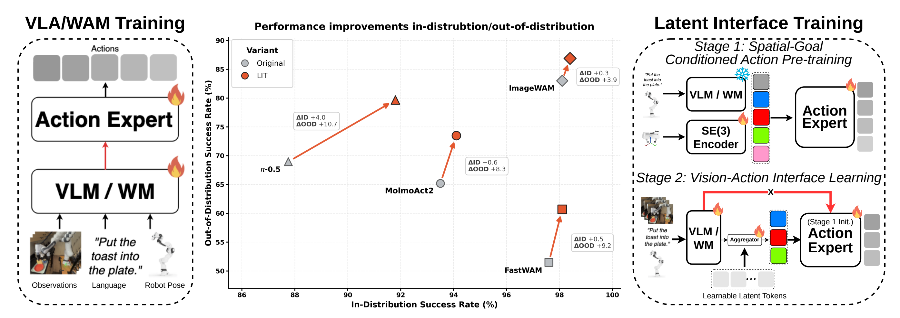
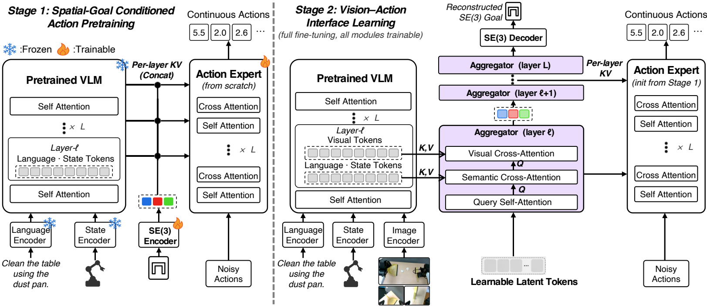
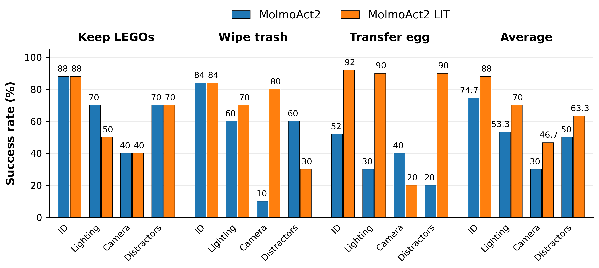
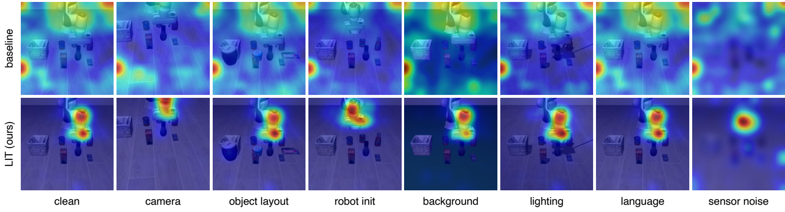
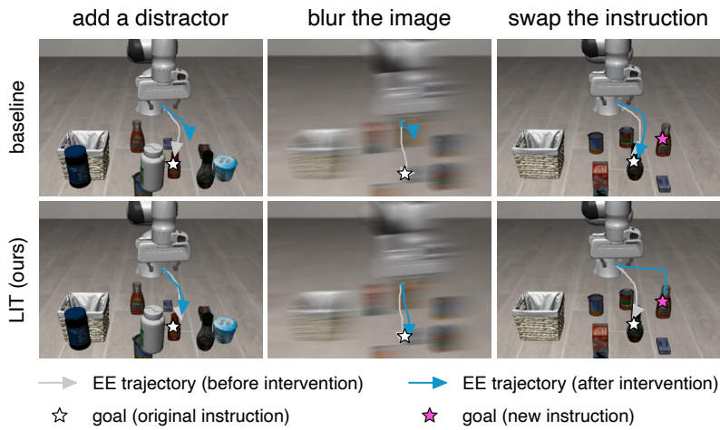

# 2026 LIT（arXiv）

# Breaking the Vision–Action Shortcut: Latent Interface Training for Generalizable Robotics Foundation Models

**作者**：Jianman Lin、Shailesh Shailesh、Zhongyi Luo、Jiafei Duan。

**发表信息**：2026 年 arXiv 预印本，arXiv:2609.12641v1。下文依据这一版本，不将预印本视为已被正式会议录用。

**资料链接**：[论文](https://arxiv.org/abs/2609.12641) · [项目主页](https://magiclab-nus.github.io/LIT/) · [代码](https://github.com/MAGICLAB-NUS/LIT) · [本地 PDF](../assets/papers/LIT.pdf)

# 1. 研究意义

## a. 研究背景：所描述的场景、背景

视觉—语言—动作模型（VLA）和世界—动作模型（WAM）常用预训练视觉骨干网络为动作专家提供条件。模型在训练场景中可以表现很好，却可能把背景、光照、相机位置等与动作偶然相关的线索当成决策依据。比如演示里目标物总在固定桌面位置，策略可能记住画面布局，而没有真正利用目标物和机械臂之间的空间关系。画面一变，这种 **vision–action shortcut** 就会失效。

LIT 的问题不是“要不要视觉”，而是**如何让视觉信息以有助于动作泛化的方式进入动作专家**。它先让动作专家在没有图像的条件下，根据语言、机器人状态和演示动作段的终点位姿学习动作；之后才引入视觉，并要求一个中间接口恢复同样的终点位姿。最终策略仍然使用图像，不需要在部署时预先知道目标位姿。

图中灰色是原模型，橙色是加入 LIT 后的结果；纵轴的 OOD 成功率对应 LIBERO-Plus 的七类扰动平均值，而不是一个新的单独任务。

## b. 问题及挑战：核心、重要、未解决的问题是什么

- **演示数据中的视觉相关性可能是伪线索。** 常规动作专家直接接收丰富的视觉表示，容易利用只在训练分布成立的背景或视角相关性。
- **完全去掉视觉又会丢失必要信息。** 物体位置和布局变化时，机器人仍需从图像判断当下该往哪里移动；仅有语言与本体状态不足以完成一般的视觉操作。
- **仅预训练动作专家并不足够。** 即便先学会无图像动作，第二阶段重新让专家直接看到视觉 token，仍可能学回捷径。
- **方法需要跨架构成立。** π₀.₅、MolmoAct2、FAST-WAM 和 ImageWAM 的骨干—动作专家耦合方式不同，不能只对一种模型有效。

# 2. 研究现状

## a. 领域的现状：针对上述问题及挑战，当前有哪些方法和技术

一种路线是**丰富视觉或空间表示**，例如加入三维位置、视觉推理轨迹、未来图像或显式子目标，让动作生成有更多任务信息。另一种路线是**筛除无关视觉因素**，通过物体感知正则化、选择性视觉瓶颈等限制策略对背景的依赖。还有一类是**先学习动作先验**：LA4VLA 等方法先用语言与机器人状态训练动作模块，再引入图像。LIT 与最后一类最接近，但又对第二阶段的视觉入口施加限制。

## b. 问题的现状：已有路线尚未解决什么

更丰富的表示不保证模型只使用任务相关部分；先学动作先验，也不保证接入视觉后不会重新形成捷径。LIT 的设计同时处理两件事：用动作段终点的空间目标建立可用的动作先验，再把视觉信息限制在一个受同一目标监督的 latent interface 中。论文的消融实验分别检查了“只分阶段训练”“只加位姿监督”和“让动作专家重新直连视觉”等替代解释。

# 3. 技术路线

## a. 问题与技术映射：针对上述问题，采用了哪些技术手段

|问题|LIT 的对应设计|
|---|---|
|训练图像可能诱导捷径|Stage 1 完全不输入图像，只训练空间目标条件化的动作专家|
|动作仍需要感知当前场景|Stage 2 用可学习 latent tokens 汇聚视觉、语言和状态表示|
|视觉接口可能只传递外观线索|用演示动作段的终点状态监督接口重建|
|直连视觉可能绕过接口|动作专家在 Stage 2 只能经接口获取视觉条件|

## b. 技术详述：对每个技术方法进行详细介绍

**训练目标与终点状态。** 在时刻 $t$，策略要预测长度为 $H$ 的动作段 $A_t=(a_t,\ldots,a_{t+H-1})$。训练时，从演示轨迹中取这段结束时的机器人状态：

$$
g_t=[p_{t+H};r_{t+H};q_{t+H}]\in\mathbb{R}^{8}.
$$

其中 $p\in\mathbb{R}^{3}$ 是世界坐标系中的末端位置，$r\in\mathbb{R}^{3}$ 是轴角朝向，$q\in\mathbb{R}^{2}$ 是夹爪关节位置。论文称之为 terminal SE(3) goal，但其实际监督向量还包含两个夹爪维度。它来自训练演示，**不是推理时额外提供的目标标签**。

**Stage 1：先学“给定空间目标如何动作”。** 冻结预训练骨干及模态编码器，仅用语言、机器人状态与 $g_t$ 作为条件。一个三层 MLP 将 $g_t$ 编码为目标 token，拼接到骨干的语义表示，再按原架构的耦合方式逐层送给动作专家。图像不参与这一阶段。论文保留每个架构原有的动作生成目标；以文中说明的 flow matching 为例，对动作段与高斯噪声插值，并预测速度：

$$
\widetilde A_t^{\tau}=(1-\tau)\epsilon+\tau A_t,\qquad
v_t^{\star}=A_t-\epsilon,\qquad
\mathcal L_{\mathrm{prior}}=\mathbb E\!\left[\|\widehat v_t^{\tau}-v_t^{\star}\|_2^2\right].
$$

这里 $\tau\sim\mathcal U(0,1)$、$\epsilon\sim\mathcal N(0,I)$。Stage 1 更新动作专家和目标编码器，学到的动作专家用于初始化下一阶段。

**Stage 2：只经由空间监督接口接入视觉。** 初始化 $K=100$ 个可学习 latent tokens。每个耦合层中，token 先自注意力，再分别以自身为 query 对语言／状态表示和视觉表示做交叉注意力，形成该层送给动作专家的条件。若干相邻层共享接口注意力参数，但使用各层自己的骨干表示。图像可以影响接口，动作专家却不再直接读取骨干视觉 token。

最终层的 latent tokens 经 MLP 重建训练演示中的同一个 $g_t$。Stage 2 同时优化原有动作损失和辅助位姿损失：

$$
\widehat g_t=D_{\omega}(Z_{L,t}),\qquad
\mathcal L_{\mathrm{stage2}}=\mathcal L_{\mathrm{act}}+0.3\,\|\widehat g_t-g_t\|_2^2.
$$

此阶段联合更新骨干、模态编码器、接口、动作专家和解码器。部署时保留 latent interface，但移除 Stage 1 的目标编码器和 Stage 2 的位姿解码器，输入仍只有图像、语言和机器人状态。因而它不是推理时先预测明确目标位姿、再用该位姿规划动作的硬性两步流水线。

## c. 创新之处：你认为最关键的技术是什么

我认为关键是**训练前后共用一个空间目标，但改变它的角色**：Stage 1 用终点位姿教动作专家“如何到达”，Stage 2 用同一位姿约束视觉接口“应该保留什么”。“仅通过接口接入视觉”又防止动作专家轻易绕开这一约束。三者构成相互配合的设计，而不只是额外加一个 pose loss。

# 4. 实验分析

## a. 实验数据：论文中使用了哪些实验数据

仿真评估用 LIBERO 的 Spatial、Object、Goal、Long 四组共 40 个任务，每任务 50 次 rollout，共 2,000 次；LIBERO-Plus 覆盖 10,030 个受扰实例，每个实例一次 rollout，包含相机、传感器噪声、光照、背景、机器人初始状态、物体布局和语言七个维度。**Overall 是七类扰动成功率的无权平均**。模型只用原始 LIBERO 演示训练，在 LIBERO-Plus 上零样本测试，没有用受扰实例适应。

真实机器人实验只比较 MolmoAct2 与其 LIT 版本，包含分离积木入盒、簸箕清理桌面、锅中鸡蛋移入碗中三项任务。论文报告联合使用 300 条演示，每任务 100 条；每种策略的分布内测试为每任务 25 次，三种分布外条件（光照、仅俯视相机、干扰物）各为每任务 10 次。

## b. 对比实验：与其他算法对比，突出数值的变化

下表摘自论文 Tables I–II，单位为成功率 %；括号是 LIT 相对**相同架构基线**的百分点变化，不是相对公开模型榜单的提升。

|架构|LIBERO 基线 → LIT|LIBERO-Plus 基线 → LIT|
|---|---:|---:|
|π₀.₅|87.75 → 91.80（+4.05）|68.97 → 79.67（+10.70）|
|MolmoAct2|93.50 → 94.10（+0.60）|63.62 → 71.92（+8.30）|
|FAST-WAM|97.60 → 98.10（+0.50）|51.44 → 60.63（+9.19）|
|ImageWAM|98.10 → 98.40（+0.30）|83.02 → 86.89（+3.87）|

四种架构的分布内平均成功率都没有下降，分布外平均成功率也都提高。七类扰动 × 四种架构的 28 个比较中，26 个提高；例外是 MolmoAct2 的语言扰动下降 2.11 点、ImageWAM 的语言扰动下降 0.92 点，因此不能说每种偏移均受益。尤其 FAST-WAM 在相机扰动上从 16.40% 升至 43.83%，增幅大，但绝对成功率仍未过半。

真实实验跨三任务平均：分布内 74.7% → 88.0%，光照 OOD 53.3% → 70.0%，相机 OOD 30.0% → 46.7%，干扰物 OOD 50.0% → 63.3%。增益分别为 13.3、16.7、16.7、13.3 个百分点。不过逐任务并非一致提高：积木任务的光照条件从 70% 降到 50%，鸡蛋任务的相机条件从 40% 降到 20%。每个 OOD 任务条件仅 10 次测试，一次成败就是 10 个百分点，应结合样本量解读。

论文还给出注意力热图与反事实轨迹。热图中，LIT 的有效 action-to-image attention 更集中在机器人与目标物附近；加干扰物或模糊画面时轨迹更稳定，改写目标指令时更能转向新目标。这些是**与减少捷径一致的定性证据**，但注意力可视化本身不是严格的因果证明。

## c. 消融实验：与自己对比，突出数值的变化

论文 Table III 在 MolmoAct2 上比较关键组件，指标是 LIBERO-Plus 七类扰动的平均成功率。

|设计|OOD 成功率|相对完整 LIT|
|---|---:|---:|
|原始 MolmoAct2|63.62%|−8.30 点|
|LIT 不做 Stage 1|68.23%|−3.69 点|
|LIT 不做位姿重建监督|68.86%|−3.06 点|
|LIT 允许动作专家直连视觉|67.74%|−4.18 点|
|LIT 同时去掉 Stage 1 与位姿监督|65.70%|−6.22 点|
|仿 LA4VLA 的分阶段训练|65.46%|−6.46 点|
|原始模型只加位姿监督|65.45%|−6.47 点|
|完整 LIT|71.92%|—|

这组结果支持“动作先验、位姿监督、受限视觉通道”共同发挥作用；特别是允许直接视觉访问后，分布内成功率仍为 94.25%（完整 LIT 为 94.10%），但 OOD 成功率下降，说明只看原分布很难发现捷径。上述实验隔离的是论文设置下的设计贡献，不等于证明接口一定学到了唯一正确的因果特征。

## d. 实验总结

LIT 最有说服力的证据不是单个最高分，而是四种不同耦合方式的架构在**相同训练预算、架构匹配的基线**下都提高了 LIBERO-Plus 平均成功率，同时保持了 LIBERO 表现。作者明确说明基线并非从已训练好的 VLA／WAM 策略 checkpoint 微调，而是从相同预训练骨干和随机初始化动作专家开始；因此这些数字不能直接与各方法原论文公布的微调成绩横向排名。

# 5. 不足之处

1. **终点位姿是有用但不完整的空间监督。** 它能约束“这段动作最后到哪里”，却不能独立编码碰撞、接触力、整段路径的中间约束或多种可行终点。论文没有单独测试更长动作段或复杂接触任务下这一标签是否足够。这是我基于方法定义提出的适用性边界，并非论文已验证的失败结论。
2. **真实世界范围仍窄。** 物理评估只在一种 MolmoAct2 策略设置和三项任务上展开，OOD 每条件每任务 10 次；还不能推出对不同机器人本体、家庭长时任务或更大规模数据都有效。论文结论也把更大、更丰富的真实演示集列为未来工作。
3. **鲁棒性增益不等于消除所有捷径。** 两个语言扰动子项下降，真实积木和鸡蛋任务也存在个别条件退步。注意力与轨迹干预能帮助解释行为，却没有证明所有任务无关线索都被排除；更系统的因子控制和多随机种子评估会增强判断。
4. **接口的额外代价需单独量化。** Stage 2 加入 100 个 latent tokens 和多层注意力，论文强调总优化步数匹配，但没有系统报告各架构推理延迟、显存或计算量的代价；部署决策仍需补充这些指标。

# 6. 基于本文扩展到的其他论文

1. [LA4VLA: Learning to Act without Seeing via Language-Action Pretraining](https://arxiv.org/abs/2606.27295)，2026。它与 LIT 都先学习无图像动作，但 LIT 的 Stage 1 加入终点位姿，Stage 2 又用受位姿监督的接口限制视觉入口。可进一步研究：若为 LA4VLA 的第二阶段加入同样接口，收益来自预训练目标还是视觉通道？
2. [LIBERO-Plus: A Progressive Robustness Benchmark for Visual-Language-Action Models](https://openaccess.thecvf.com/content/CVPR2026/html/Fei_LIBERO-Plus_A_Progressive_Robustness_Benchmark_for_Visual-Language-Action_Models_CVPR_2026_paper.html)，CVPR 2026。LIT 用它检验多种任务保持的分布偏移。阅读时需分别看七类扰动及绝对成功率，不能只引用平均增幅。
3. [Object-Aware Regularization for Addressing Causal Confusion in Imitation Learning](https://proceedings.neurips.cc/paper/2021/hash/17a3120e4e5fbdc3cb5b5f946809b06a-Abstract.html)，NeurIPS 2021。它从物体感知正则化角度抑制视觉伪相关，与 LIT 的接口约束互补；值得比较两者在相同数据增强和扰动设置下的效果。
