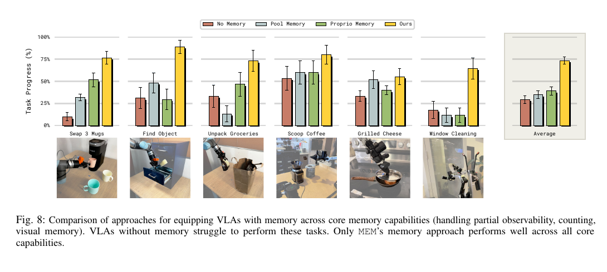
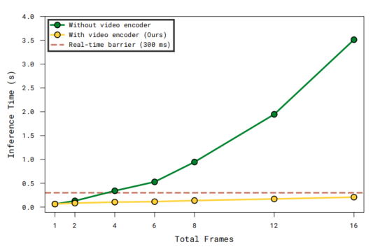
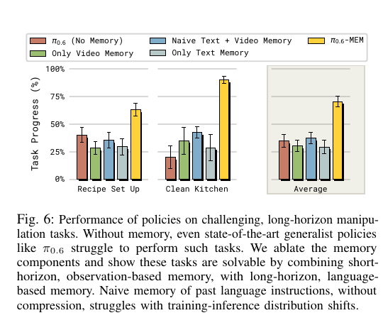

# MEM：面向长时程任务的机器人记忆

## 1\. 研究意义

### **1\.1 研究背景**

机器人 VLA 模型通常根据语言指令、当前图像和机器人状态直接预测动作。这一范式适合“拿起杯子”“关上抽屉”等短技能，但现实工作常由多个相互依赖的子任务组成，例如整理一份食谱所需物品、清理整间厨房或将多袋杂货分类收纳。这类任务具有明显的部分可观测性。当前帧只能描述“现在看到了什么”，不能完整描述“之前发生了什么”。因此，一个只读当前帧的 VLA 即使低层动作能力很强，也可能重复已经完成的步骤、遗漏子目标，或在相似场景中选错物体。

MEM 的研究目标是把 VLA 从“短视频级的单技能执行”推向“分钟级的多阶段任务”。它借鉴人类短期与长期记忆的功能分工：用高保真的近期视觉记录动作细节，用高度压缩的语言记录较久以前的事件和任务进度。这是一种工程上的功能类比，并不意味着模型复现了人脑的神经机制。

### **1\.2 问题及挑战**

#### **1\.2\.1 核心、重要、未解决的问题**

|核心问题|为什么重要|问题规模或难度的量化|
|---|---|---|
|短时视觉窗口覆盖不了完整长任务|任务早期发生的事件可能在最终决策前数分钟就已离开窗口|论文最长任务约 15 分钟，即约 900 秒；实验中短期视频记忆最长约 54 秒，只覆盖整个时长的约 6%，其余约 94% 的时间跨度必须依靠更高层的压缩记忆|
|当前帧存在不可消除的观察歧义|某些状态只在过去出现，当前画面本身没有足够证据|Find Object 中物体随机放入 4 个抽屉；若忘记放置过程，选对抽屉的随机概率仅 25%。Scoop Coffee 中若忘记是否已经加过一勺，只能在“继续/停止”之间猜测，随机概率为 50%|
|长任务需要维护多个相互依赖的子目标|某一步动作正确，不代表整套流程没有遗漏或重复|Recipe Setup 中一份食谱通常包含 6–7 个计分物品；训练覆盖 42 种食谱，评测在 5 种食谱的未见厨房和未见物体配置中进行|
|直接堆叠历史图像会造成 token 与注意力计算膨胀|历史越长，显存、延迟和训练成本越高|以 16 帧为例，未经压缩会产生约为单帧 16 倍的视觉 token；若对全部时空 token 做全注意力，成对注意力项相对单帧可增长到约 256 倍|
|模型需要根据失败历史改变策略|当前画面可能不直接显示失败原因，重复试错会形成无效循环|开冰箱任务没有明显视觉线索说明铰链位于哪一侧；评测要求机器人在不超过 4 次抓取尝试内打开冰箱，用于检验它是否根据先前失败主动换方向|

## **2\. 研究现状**

### **2\.1 领域的现状**

|技术类别|处理方式|优点|代表或与 MEM 的关系|
|---|---|---|---|
|无显式记忆 / 当前帧策略|每一步只输入当前观察、当前机器人状态和任务指令|延迟低，训练简单|π0\.5 已能通过高低层子任务结构完成部分长任务，但没有 MEM 式滚动语言摘要和视频历史编码器|
|稠密历史上下文|把多帧图像的全部视觉 token 一起送入主干网络|历史信息完整|随帧数增加，token 数和跨帧注意力成本很高|
|Pool Memory|各历史帧先编码，再将历史特征平均池化成一个或少量 memory token|压缩率高，成本低|MEM 论文的直接 baseline；受到 ContextVLA 一类压缩方法启发|
|Proprio Memory|只保留关节角、末端位姿、力矩等低维机器人状态历史|很便宜，适合记录机器人自身运动和接触|MEM 论文的直接 baseline，与 TA\-VLA 一类方法相关|
|关键帧选择或检索|从较长历史中选择相关帧，再用于当前决策|可以覆盖较远历史，同时减少输入|MemER 等方法；性能依赖检索或关键帧选择是否正确|
|语言化记忆|把历史事件、计划或任务进度压缩成文字|跨越时间长、token 少、可解释|难以保留物体的精确位置、姿态和微小动作差异|
|隐状态 / 递归潜变量|用 RNN、Transformer cache 或可学习 latent 持续更新内部状态|表达紧凑，可端到端学习|内部含义较难解释，长时间更新可能累积误差|
|多尺度混合记忆|近期历史保留视觉细节，远期历史压缩为语义摘要|在信息量和计算量之间取得平衡|MEM 的核心路线|

## **3\. 技术路线**

### **3\.1 问题与技术映射**

|待解决问题|MEM 的技术手段|直接作用|
|---|---|---|
|当前帧看不到最近发生的动作和物体变化|短期视频记忆：历史帧加时间位置编码，通过因果时间注意力融合|保存最近数秒至几十秒的几何、位置和动作变化|
|长任务中已完成步骤离开视觉窗口|长期语言记忆：滚动摘要（`m_t → m_{t+1}`）|保存关键事件、完成进度、失败和后续需要的信息|
|VLA 不知道接下来应执行哪个子任务|高层策略同时预测下一子任务与更新后的长期记忆|将“记住历史”和“决定下一步”放在同一推理循环中|
|多帧输入导致 token 爆炸|只向 VLA 主干输出当前时刻的视觉 token，历史帧仅参与编码阶段的融合|输入帧数增加时，主干接收的视觉 token 数基本保持为单帧规模|
|机器人自身运动与视觉变化需要结合|将历史 proprioception 分别投影成每个时刻的连续 token|补充关节、末端位置和接触相关信息|
|记忆能力不能只靠少量任务后训练学到|在预训练和后训练阶段都加入历史观察与记忆样本|让视频记忆成为基础能力，再适配具体任务|

### **3\.2 技术详述**

#### **3\.2\.1 总体框架**

MEM 接在 π0\.6 VLA 上，可用下式概括：

$\pi(a_t,l_{t+1},m_{t+1})\approx\pi_{LL}(a_t\mid o_{t-K:t},s_{t-K:t},l_t,g)\;\pi_{HL}(l_{t+1},m_{t+1}\mid o_t,m_t,g)$

其中，g 是总任务，o 是视觉观察，s 是机器人本体状态，l 是当前或下一子任务，m 是长期语言记忆。高层策略负责较慢时间尺度上的子任务切换和摘要更新；低层策略根据近期视频、机器人状态和当前子任务连续生成动作。MEM 不会先离线列出一张固定的完整任务清单再逐项执行；它在执行过程中利用滚动记忆，根据当前状态不断更新“已发生什么”和“下一子任务是什么”。低层动作仍由 VLA 在线生成。

#### **3\.2\.2 短期记忆**

π0\.6 原本使用 SigLIP ViT 编码当前图像。MEM 保留其空间编码能力，并加入时间维度：

1. 将过去帧与当前帧分别切成空间 patch token。

2. 为每个时刻加入固定的正弦时间位置编码；当前帧设为 t=0，过去帧带负向时间标记，使模型知道先后顺序和时间距离。

3. 在视觉编码器中每隔四层加入一次因果时间注意力。同一空间位置的 patch 可以读取当前及更早时刻的信息，不能读取未来信息。

4. 编码完成后丢弃历史时刻的输出 token，只保留已经吸收历史信息的当前时刻 token，再送入 VLA 主干。

5. 训练配置中，预训练常使用 6 个观察时刻，即 5 个过去观察加当前观察，间隔约 1 秒；后训练可扩展到最多 18 帧、约 54 秒的近期历史。模型最多处理 4 个相机、448×448 图像。

#### **3\.2\.3 长期记忆**

1. 长期记忆 m\_t 是一段简洁的语言描述，用于记录跨越短视频窗口后仍有价值的信息。高层模型接收总任务、当前观察和旧记忆，同时生成下一子任务 l\_\{t\+1\} 与新记忆 m\_\{t\+1\}。更新后的摘要在下一轮再次作为输入。

2. 训练时，论文使用一个外部预训练 LLM，根据带有子任务、成功或失败标注的轨迹生成长期记忆监督文本。部署时不需要这个外部 LLM 在线更新：经过训练的高层策略自己输出 `m_{t+1}`。因此，“通过另一个模型更新”只适用于训练标签生成阶段，在线执行时由 MEM 高层模型完成更新。

#### **3\.2\.4 与 π0\.6 的结合方式**

π0\.6\-MEM 的主体仍是约 5B 参数的 VLA：约 4B 的 Gemma 3 VLM 主干，其中包括约 400M 的 SigLIP 视觉编码器，再配合约 860M 的 flow\-matching action expert。MEM 主要改动信息进入主干前的历史编码方式，以及高层子任务与长期摘要的输出形式；动作 expert 仍负责生成连续机器人动作。

### **3\.3 创新之处**

根据时间尺度选择不同的信息载体，并让两种记忆共同服务于同一个 VLA 控制循环：

- 近期信息仍需要抓取位置、物体姿态和动作变化，因此用视频表示。

- 较远信息主要需要任务进度、关键事件和计划，因此用语言表示。

- 历史视觉只在编码阶段参与融合，主干 token 数不随帧数线性膨胀。

## **4\. 实验分析**

### **4\.1 实验数据**

论文没有只使用一个公开标准数据集，而是使用 Physical Intelligence 自建的数据混合和真实机器人评测任务：

|数据或评测组|内容|主要检验能力|
|---|---|---|
|预训练混合数据|遥操作机器人示范、策略 rollout、人类纠正、视觉语言数据、视频语言或描述数据|学习通用视觉、语言、动作能力及历史编码|
|六项核心记忆任务|Swap 3 Mugs、Find Object、Unpack Groceries、Scoop Coffee、Grilled Cheese、Window Cleaning|短期视觉记忆、部分可观测性、动作历史利用|
|Recipe Setup|训练涉及 42 个食谱；评测包含 5 个训练中见过的食谱，但厨房和物体配置未见|多子任务规划、长期进度和场景泛化|
|Clean Kitchen|连续执行多项厨房清洁工作|长时程进度维护和子任务切换|
|常规灵巧操作任务|Table Bussing、Shirt Folding、Clean Up Counter、Make Bed、Dishes to Sink、Batch Folding、Box Building|检验加入记忆后是否损害常规低层控制|

### **4\.2 对比实验**

#### **4\.2\.1 不同短期记忆表示**

|方法|平均任务进度|MEM 相对提升|
|---|---|---|
|无记忆|约 30%|\+44 个百分点|
|Pool Memory|约 35%|\+39 个百分点|
|Proprio Memory|约 40%|\+34 个百分点|
|MEM 视频记忆|约 74%|—|

#### **4\.2\.2 长视频输入效率**

论文 Fig\. 3 的 16 帧设置显示，朴素地扩大视频上下文推理约需 3\.5 秒，而 MEM 约需 0\.2 秒，速度约提高 17\.5 倍。这个结果与其结构一致：历史帧在视觉编码器内融合，VLA 主干只接收当前时刻输出 token。该速度比仅适用于论文给出的硬件、模型和帧数配置，不应被表述为所有设备上的固定加速倍数。

#### **4\.2\.3 利用历史进行在线适应**

论文还测试机器人能否根据先前交互改变后续行为：筷子任务提升约 11 个百分点，开冰箱任务提升约 62 个百分点。较大的差异表明，当成功策略依赖先前失败或环境反馈时，记忆的作用可能远大于普通单步操作。

### **4\.3 消融实验**

|记忆配置|Recipe Setup|Clean Kitchen|解释|
|---|---|---|---|
|无记忆|约 40%|约 20%|容易遗漏或重复子任务|
|仅视频记忆|约 29%|约 35%|有近期细节，但不能稳定维护完整长程进度|
|朴素文本 \+ 视频|约 36%|约 43%|两种信息都有，但融合方式不如完整设计有效|
|仅文本记忆|约 30%|约 28%|有全局语义，但缺少近期视觉细节|
|完整 MEM|约 63%|约 90%|多尺度记忆互补，整体最好|

### **4\.4 实验总结**

1\. **计算预算应集中在信息进入主干之前。** 先在视觉编码器内融合历史，再把固定规模 token 交给大模型，是一种可迁移的系统设计。

2\. **长程规划需要显式、可更新的任务状态。** 一段简短语言摘要比持续堆叠历史图像更适合跨越多子任务。

## **5\. 不足之处**

1\. **数据开放性有限。** 训练数据主要为自建机器人数据，完整规模、混合比例和原始轨迹未公开，外部团队难以复现同等训练条件。

2\. **核心指标多为任务进度。** 高任务进度不一定意味着整项任务可靠完成，也不能直接推出安全性、连续运行稳定性或成功率。

3\. **语言摘要存在不可逆信息损失。** 一旦高层遗漏关键事件或生成错误摘要，错误可能在后续循环中持续传播；论文没有系统分析摘要错误的检测和纠正。

4\. **短期窗口仍有固定上限。** 超出视频窗口的精确几何细节会被丢弃，而语言难以完整代替这些信息。

5\. **计算成本仍然较高。** MEM 大幅降低了朴素长视频输入成本，但系统仍基于约 5B 参数模型和高端加速器；对低功耗或边缘机器人平台的适用性未充分验证。

## **6\. 参考资料**

- [MEM 官方介绍](https://www.pi.website/research/memory)

- [π0\.7](https://arxiv.org/abs/2604.15483)[ 原论文](https://arxiv.org/abs/2604.15483)

- [π0\.7 官方介绍](https://www.pi.website/blog/pi07)

- [ContextVLA：Pool Memory 相关路线](https://arxiv.org/abs/2510.04246)

- [MemER：关键帧选择与记忆路线](https://arxiv.org/abs/2510.20328)

- [TA\-VLA：Proprio Memory 相关路线](https://openreview.net/pdf/0daa40e6d51680e0d713917ea00f499035f8f68b.pdf)
