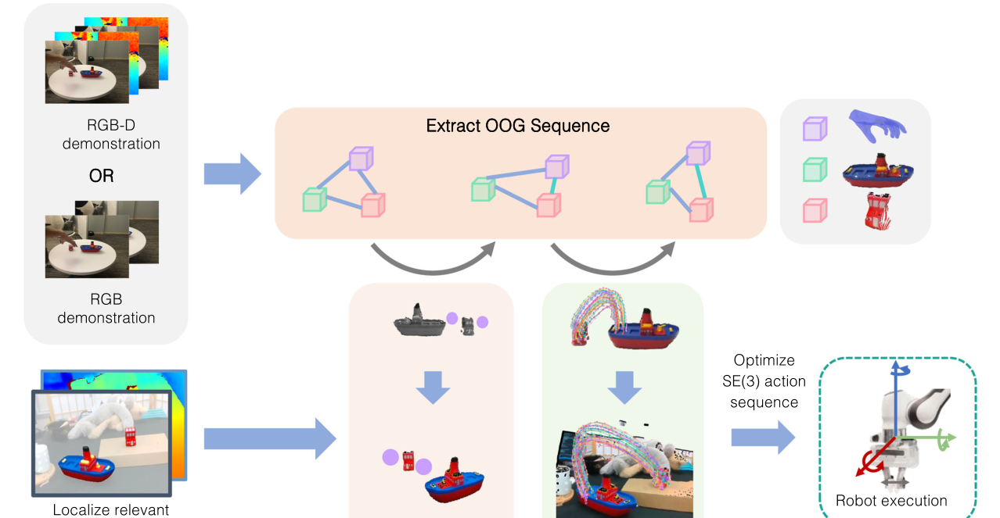
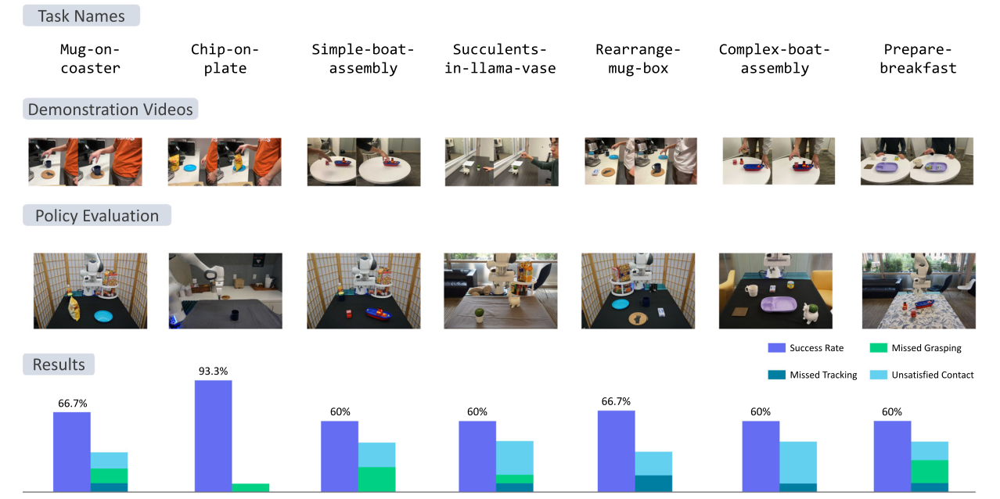
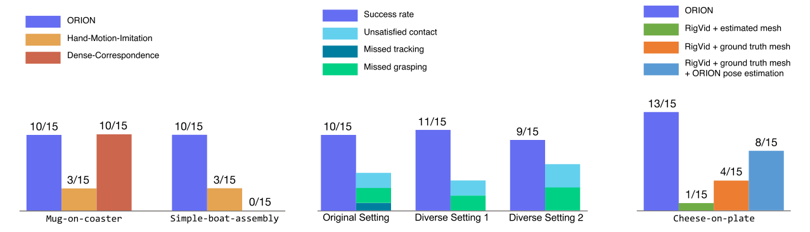

# 2026 ORION \(Autonomous Robots\)

# Vision-based Manipulation from Single Human Video with Open-World Object Graphs

**作者与机构**：Yifeng Zhu、Arisrei Lim、Peter Stone、Yuke Zhu；作者来自 **The University of Texas at Austin、Sony AI**。

**发表信息**：**Autonomous Robots，2026，50:27**；在线发表于 2026 年 5 月 8 日，DOI: 10\.1007/s10514-026-10253-8。

# 1\. 研究意义

## a\. 研究背景：所描述的场景、背景

ORION 研究如何让机器人只观看一段人类操作视频，就在新的真实环境中复现同一任务。视频可以由 iPad、手机等日常设备拍摄，也可以来自 YouTube 或视频生成模型；它只提供 RGB 或 RGB-D 画面，没有机器人动作、关节状态或人工标注。部署时，机器人面对的背景、相机视角、物体布局，甚至同类物体实例都可以与演示不同。

以玩具船装配为例，演示者把红色积木和烟囱部件依次放到船体上。机器人真正需要继承的不是人的手臂轨迹，而是“操作哪些物体、在哪里抓、物体之间的接触关系如何变化，以及物体沿什么路径到达下一个子目标”。ORION 因而把单条视频抽象成一串 **Open-World Object Graphs（OOGs）**：每张图对应一个关键帧状态，图中记录任务相关物体、抓取信息、接触关系和物体运动轨迹。

这种表示承担了人类视频与机器人动作之间的接口。演示端负责说明对象交互过程，执行端根据当前场景重新定位目标物体和参考物体，将演示轨迹变形到新的起点与终点，再优化出机器人末端的 SE\(3\) 动作序列。整个过程不需要为该任务额外采集机器人遥操作数据或进行真实环境自探索。

## b\. 问题及挑战：核心、重要、未解决的问题是什么

- **单条人类视频没有机器人动作标签，且人与机器人存在 embodiment gap。** 人手的形态、抓取方式和运动学约束与机械臂不同，直接复现手部轨迹会把演示者特定的姿态带入策略，也很难适应新的物体摆放。系统需要提取与执行者形态相对无关、又足以恢复任务的对象交互信息。
- **开放世界变化同时包含外观与几何变化。** ORION 将 open-world 设置具体定义为四个轴：视觉背景、相机角度、空间布局和同类新物体实例。模型既要在自然视频中识别未预先注册的任务物体，也要把演示中的三维运动关系迁移到新的工作空间，不能只依赖像素相似性或绝对坐标。
- **多阶段任务需要从长视频中恢复子目标和接触变化。** 完整视频包含大量平滑运动和遮挡，逐帧复制既冗余又不稳定。机器人必须判断何时抓取、何时放下、当前对应演示中的哪个阶段，以及下一步应该移动哪个目标物体。
- **RGB-only 视频缺少真实尺度和深度。** 单目深度只能提供有噪声的距离估计，生成的物体网格也没有可靠尺度；而 6-DoF 位姿跟踪又依赖深度与几何。ORION 需要用模型先验和多组深度假设补足这些信息，同时避免把估计误差继续传入动作优化。

# 2\. 研究现状

## a\. 领域的现状：针对上述问题及挑战，当前有哪些方法和技术，着重一个技术分类

按照“从人类视频中保留什么信息”可以把相关路线分为四类。

- **表征预训练与奖励学习方法**利用大规模人类视频预训练视觉表征、价值函数或奖励，再通过机器人数据学习动作。它们能利用视频规模，但通常仍需要目标任务或目标机器人的遥操作数据，不能直接从一条 actionless 视频得到可执行策略。
- **单示范模仿与自探索方法**通过元学习、模仿学习或真实环境 self-play，从一条演示快速适应任务。这类方法往往依赖大量同分布元训练任务，或只适合易于自动复位的短任务；对需要多次重置的多阶段真实操作，额外数据成本仍然较高。
- **demonstrator-centric 方法**重建人的身体、手部或末端运动，再重定向到机器人。OKAMI 属于这一路线，它适合从完整人体动作迁移到人形机器人。Hand-Motion-Imitation 也直接依据手轨迹生成动作，但手的绝对运动会随拍摄视角与物体布局改变，跨场景泛化受到限制。
- **object-centric 方法**把物体、关键点、位姿或对象关系作为中间表示。SPOT 使用目标相对的 SE\(3\) 物体轨迹，ORION 则把对象状态、接触关系、抓取点和关键点／位姿轨迹组织为 OOG 序列。RIGVid 通过视频生成模型先合成任务视频，再估计物体位姿并导出动作，也属于以对象运动连接视觉与控制的路线。

## b\. 问题的现状：针对以上技术，这些技术有哪些不足之处

表征预训练可以告诉模型“画面中发生了什么”，但不会自然给出机器人应该执行的精确 SE\(3\) 动作；单示范适应若依赖机器人自探索，就失去了“只看一段视频”的低成本优势。手部重定向保留了执行者运动，却没有显式突出任务对象之间的关系，场景布局变化后容易把手放到错误的绝对位置。

物体中心表示更适合跨 embodiment，但表示过于紧凑时可能漏掉关键交互。只保留终点无法表达绕行、倾倒或多阶段接触，只保留位姿轨迹又不一定知道该抓哪里、何时开合夹爪。另一方面，图结构越丰富，感知 pipeline 越复杂，分割、点跟踪、网格重建、位姿估计和全局配准的错误也会逐级累积。ORION 的目标不是消除这组权衡，而是在单视频、开放世界和可执行性之间选择一套结构化接口。

# 3\. 技术路线

## a\. 问题与技术映射：针对上述问题，采用了哪些技术手段

针对 actionless 视频，ORION 用 VLM 和开放词汇视觉模型自动发现并跟踪任务物体；针对多阶段过程，利用对象运动速度的变化检测关键帧，并把每个关键帧编码为 OOG。针对人与机器人的形态差异，策略不复制手的绝对轨迹，而是识别目标物体与参考物体，把对象中心轨迹重定向到测试场景。针对 RGB-only 输入，系统结合单目深度、InstantMesh 和改造后的 FoundationPose 恢复带尺度的 6-DoF 位姿轨迹。最终，轨迹通过 SE\(3\) 优化、逆运动学和关节阻抗控制转换为机器人动作。



## b\. 技术详述：对每个技术方法进行详细介绍

**OOG：用两层图表示对象、交互与运动。** 记一张 Open-World Object Graph 为 $G=(V,E)$。高层包含 object nodes 和 grasp node，低层包含隶属于对象的 point nodes；对象节点与抓取节点之间是带接触属性的边，point node 与 object node 之间是归属边。

| 组成                            | 保存的信息                                            | 在策略中的作用                     |
| ------------------------------- | ----------------------------------------------------- | ---------------------------------- |
| Object node                     | 彩色三维点云；RGB-only 时还包含估计网格               | 说明对象是什么、在哪里以及几何形状 |
| Grasp node                      | 交互点与夹爪开合状态                                  | 把人类交互位置重定向为机器人抓取   |
| Point node                      | RGB-D 的三维关键点轨迹，或 RGB-only 的 6-DoF 位姿轨迹 | 描述两个关键帧之间对象应如何运动   |
| Object-object／object-hand edge | 是否接触的二值属性                                    | 识别当前阶段与下一子目标           |
| Object-point edge               | 关键点属于哪个对象                                    | 组织低层运动特征                   |

OOG 的价值不在于画出一张普通 scene graph，而在于把**关键状态**和**状态之间的运动**放入同一结构。$G_l$ 记录第 $l$ 个子目标附近的对象关系，point node 的 feature trajectory 则保存从 $G_l$ 到 $G_{l+1}$ 的过程。这样，一串 $\{G_0,\ldots,G_L\}$ 既能表示任意长度任务，也允许机器人按当前接触关系定位执行阶段。

**从视频发现任务物体：VLM 负责命名，视觉模型负责定位。** ORION 从视频采样若干帧，提示 GPT-4o 返回任务相关物体的文字描述，并判断哪个物体正在被操作。Grounded-SAM 根据这些开放词汇描述分割首帧对象，Cutie 再把掩码传播到后续帧。论文报告，在单张 NVIDIA A5000 上逐帧运行 Grounded-SAM 约需 0\.4 秒，而首帧分割后使用 Cutie 跟踪约需 0\.024 秒／帧。部署时仍使用相近的识别流程，并借助 GROOT 的 Segmentation Correspondence Model 过滤干扰物体产生的假阳性掩码。

**关键帧发现：用对象运动变化近似接触阶段变化。** 在 RGB-D 分支中，ORION 在对象掩码内采样点，由 CoTracker 跨长视频跟踪，并利用其显式遮挡建模提高轨迹连续性。随后对关键点速度统计执行无监督 changepoint detection；抓起、放下等接触变化通常伴随速度模式突变，因此可把长视频压缩成少量 OOG。RGB-only 分支直接取首尾两个关键帧，即 $K=2$，将中间运动保存在完整 6-DoF 位姿轨迹里。这个简化对论文任务有效，但不等于任意 RGB 长任务都只需两个阶段。

**RGB-D 分支：三维关键点、手部重建与平面归一化。** 对象掩码与深度反投影形成点云，二维 TAP 轨迹结合深度得到三维关键点轨迹。HaMeR 重建人手网格，指尖位置用于估计抓取点和手的开合状态。由于演示相机外参未知，系统估计桌面平面，并把所有点云旋转到桌面法向与世界坐标 $z$ 轴一致，以便计算接触关系。该分支用多个局部关键点而非单一物体位姿描述运动，但依赖可靠深度、点跟踪、手部重建和点云配准。

**RGB-only 分支：用几何先验补齐尺度和位姿。** 对每个对象，系统先用单目深度估计得到掩码区域的中值距离 $m$，再由 InstantMesh 生成无尺度网格，并用深度反投影点云的包围盒将网格缩放到近似真实尺寸。原始 FoundationPose 不接受 RGB-only 输入，因此作者不把单帧估计深度直接当作确定值，而是在 $[m-0.15,m+0.15]$ 米范围生成多组位姿假设，交给 FoundationPose refinement 选择更可靠的 6-DoF 轨迹。抓取位置不再重建被遮挡的人手，而是根据估计网格／点云使用几何启发式。这说明“RGB-only”指演示视频不含深度，并不代表整个系统不使用深度估计与三维模型。

流程可以概括为：

```text
RGB 视频
  ↓
开放词汇分割 + 视频对象跟踪
  ↓
单目深度 + InstantMesh 尺度恢复
  ↓
在中值深度 ±0.15 m 内生成位姿假设
  ↓
FoundationPose refinement
  ↓
6-DoF 对象位姿轨迹 + OOG 序列
```

**图匹配与对象角色识别：先判断当前处于哪一阶段。** 部署时，机器人重新观测并生成当前 OOG，根据已满足的接触关系在演示计划中找到匹配的 $G_l$，再取下一张 $G_{l+1}$。两张图之间发生运动的对象被视为 target object，与其形成新接触或提供空间参照的对象被视为 reference object。RGB-D 分支根据轨迹平均速度确定角色；RGB-only 分支使用 VLM 分类结果。

**轨迹 warping：保留运动形状，替换起终点。** RGB-D 分支先用 FPFH 特征和 RANSAC 全局配准，把演示中的目标／参考对象点云对齐到当前场景，得到新的关键点起点 $s$ 与终点 $e$。对于演示轨迹 $\tau$，先减去首点得到 $\tau_{norm}$，再用 Rodrigues 旋转把原始首尾方向对齐到 $e-s$，按两段长度之比缩放，最后平移到 $s$：

$$
\tau_{warped}=\frac{\lVert e-s\rVert}{\lVert \tau_L-\tau_1\rVert}A\tau_{norm}+s.
$$

RGB-only 分支除平移外还要 warp 旋转：先对齐 reference-to-target 方向，再把旋转序列归一化到首帧单位姿态，最后用 SLERP 施加满足真实起终姿态的平滑边界旋转。这里迁移的是轨迹的方向和曲率模式，而不是演示中的绝对位置。

**从对象轨迹到机器人动作。** 对 RGB-D 关键点轨迹，ORION 优化每一步末端变换 $T_i$，使上一时刻的对象关键点经 $T_i$ 后尽量对齐下一时刻目标；实现中先优化旋转 200 步，再联合优化平移和旋转 200 步，避免四元数旋转陷入近似不变的平凡解。RGB-only 分支已有完整对象位姿轨迹，可通过固定的抓取变换直接恢复末端位姿。随后系统加入 grasp node 中的夹爪状态，经逆运动学得到关节序列，并以关节阻抗控制执行。每完成一个阶段便重新观测、匹配 OOG 和生成下一段动作，直到任务成功或失败。

## c\. 创新之处：你认为的上述方法中，最关键的技术是什么

我认为最关键的是**用 OOG 序列把开放世界感知、任务阶段和对象运动统一成可执行接口**。单独使用 VLM、Grounded-SAM、CoTracker、FoundationPose 或 SE\(3\) 优化都不是论文的主要新意；ORION 的贡献在于规定这些模块交换什么结构化信息：对象节点处理开放类别与几何，接触边标记阶段，抓取节点保存交互入口，point node trajectory 连接相邻子目标。

与只保存物体位姿轨迹相比，OOG 显式加入了“谁与谁接触、抓哪里、当前在哪个阶段”；与直接复制人手相比，它又把人的具体形态从执行接口中剥离。可借鉴的设计原则是：从人类视频迁移到机器人时，优先寻找双方共享的 **object interaction**，再把本体相关控制留给执行端。不过，这个优势建立在任务能被少量刚体、接触关系与几何轨迹充分描述的前提上。

# 4\. 实验分析

## a\. 实验数据：论文中使用了哪些实验数据

实验全部使用 7-DoF Franka Emika Panda，部署观测来自单台 Intel RealSense D435。RGB-D 演示由固定在支架上的 iPad TrueDepth 相机录制，RGB 为 1920×1080，深度为 640×480；RGB-only 演示来自作者视频、YouTube、Veo 2 生成视频，或把同一 RGB-D 录像移除深度通道。每个任务／设置评测 15 次，测试时持续改变物体布局，并按任务进一步改变背景、相机角度和物体实例。

| 评测              | 任务与来源                         | 测试规模                 | 主要泛化因素                           |
| ----------------- | ---------------------------------- | ------------------------ | -------------------------------------- |
| RGB-D 真实实验    | 7 个设置：4 个短任务、3 个长任务   | 7×15=105 次             | 背景、视角、布局、同类新实例           |
| RGB-only 真实实验 | 5 个设置：作者视频、YouTube、Veo 2 | 5×15=75 次              | 视频来源、缺少真值深度、布局与实例变化 |
| RIGVid 对比       | Robosuite 中的 Cheese-on-plate     | 4 种方法／假设，各 15 次 | 网格质量、位姿估计与生成视频质量       |

RGB-D 的三个长任务分别是 Rearrange-mug-box、Complex-boat-assembly 和 Prepare-breakfast。论文把“长任务”定义为需要满足多个接触关系的多阶段任务，而不是按真实执行分钟数划分。全部 12 个真实设置共 180 次测试，ORION 成功 134 次，对应论文摘要报告的平均成功率 74\.4%。



## b\. 对比实验：与其他算法对比，突出数值的变化

**RGB-D：单条演示在七个真实设置上平均成功率为 66\.7%。** 单位为成功率，每项 15 次，数据来自 Figure 4。

| 任务                     | 成功次数 | 成功率 |
| ------------------------ | -------: | -----: |
| Mug-on-coaster           |   10／15 | 66\.7% |
| Chips-on-plate           |   14／15 | 93\.3% |
| Simple-boat-assembly     |    9／15 | 60\.0% |
| Succulents-in-llama-vase |    9／15 | 60\.0% |
| Rearrange-mug-box        |   10／15 | 66\.7% |
| Complex-boat-assembly    |    9／15 | 60\.0% |
| Prepare-breakfast        |    9／15 | 60\.0% |
| 合计                     |  70／105 | 66\.7% |

论文给出的总体 95% Wilson 置信区间为 57\.2%–75\.0%。短任务 Mug-on-coaster 与其长任务扩展 Rearrange-mug-box 都是 10／15；Simple-boat-assembly 与 Complex-boat-assembly 都是 9／15。作者据此认为多阶段没有带来明显下降，但每组样本量只有 15，且两个长任务只是向对应短任务增加子目标，因此更准确的结论是：**OOG 阶段匹配在这些有限任务上没有观察到额外成功率损失**。

**对象中心表示优于直接复制手运动，但 TAP 的收益依赖任务。** Figure 5(a) 只在两个任务上比较三种方法。

| 任务                 |  ORION | Hand-Motion-Imitation | Dense-Correspondence |
| -------------------- | -----: | --------------------: | -------------------: |
| Mug-on-coaster       | 10／15 |                 3／15 |               10／15 |
| Simple-boat-assembly | 10／15 |                 3／15 |                0／15 |

Hand-Motion-Imitation 在两项任务都只有 3／15，支持对象运动比演示手的绝对轨迹更能适应新布局。Dense-Correspondence 在简单杯垫任务与 ORION 持平，却在精细装配上降到 0／15。作者观察到光流会在平滑运动中间错误发现关键帧，而 CoTracker 的长时点轨迹与速度变化更容易对应接触转换。这说明 TAP 主要改善了关键帧与对象轨迹的稳定性，不能据两项任务断言它在所有场景都优于 dense correspondence。

**与 RIGVid 的比较揭示网格和位姿估计的影响。** Robosuite 的 Cheese-on-plate 结果如下。

| 方法／条件                         | 成功次数 | 成功率 |
| ---------------------------------- | -------: | -----: |
| ORION                              |   13／15 | 86\.7% |
| RIGVid + InstantMesh 估计网格      |    1／15 |  6\.7% |
| RIGVid + 真值扫描网格              |    4／15 | 26\.7% |
| RIGVid + 真值网格 + ORION 位姿估计 |    8／15 | 53\.3% |

真值网格和 ORION 的多深度假设位姿估计分别改善了 RIGVid，但仍未追上 ORION。论文把剩余失败归因于生成视频可能让目标出画、产生不合适运动，以及单目深度在物体运动时不一致。这个对比支持“在演示阶段筛选视频比每次部署时生成视频更可控”，但 ORION 与 RIGVid 的输入假设和 pipeline 并不完全相同，结果不应解读为单一模块的公平替换。



**RGB-only：五个设置平均成功率为 85\.3%。** 数据来自 Figure 6。

| 任务                     | 演示来源         | 成功次数 | 成功率 |
| ------------------------ | ---------------- | -------: | -----: |
| Succulents-in-llama-vase | 作者演示去除深度 |   10／15 | 66\.7% |
| Cheese-on-plate          | 作者演示去除深度 |   14／15 | 93\.3% |
| Pour-juice               | YouTube          |   12／15 | 80\.0% |
| Peas-on-plate            | Veo 2            |   14／15 | 93\.3% |
| Mug-on-coaster           | Veo 2            |   14／15 | 93\.3% |
| 合计                     | 多来源           |   64／75 | 85\.3% |

这些结果证明 ORION 能处理不带真值深度的单视频，并覆盖互联网与生成视频来源。但 85\.3% 高于 RGB-D 的 66\.7% 不能直接说明“RGB 比 RGB-D 更好”，因为两组任务构成不同。论文只在 Succulents-in-llama-vase 上进行同任务比较，RGB-only 略高；作者认为 6-DoF 位姿与网格的几何先验，用位姿估计噪声替换了 RGB-D 分支的全局配准和末端优化噪声。

## c\. 消融实验：与自己对比，突出数值的变化

**不同演示视频条件的消融。** 作者为 Mug-on-coaster 额外录制两条背景、相机角度和布局明显不同的视频，再在同一测试条件下分别构造策略。

| 演示条件   | 成功次数 | 成功率 |
| ---------- | -------: | -----: |
| 原始设置   |   10／15 | 66\.7% |
| 差异设置 1 |   11／15 | 73\.3% |
| 差异设置 2 |    9／15 | 60\.0% |

三组差异没有统计显著性，$\chi^2(2)=0.6,\ p\approx0.74$。这为“策略不依赖某一个演示背景或视角”提供了直接证据，但只覆盖一个任务、三条视频和每组 15 次测试。

其他对比也能验证设计选择，却不是完整的独立模块消融：Hand-Motion-Imitation 同时改变了表示和动作生成依据；Dense-Correspondence 替换轨迹来源后也改变关键帧质量；RIGVid 对比同时涉及生成视频、网格和位姿估计。论文没有逐项移除 OOG 接触边、grasp node、轨迹 warping、平面归一化或闭环图匹配。

| 需要验证的设计      | 已有证据                                | 仍缺少的受控对照                               |
| ------------------- | --------------------------------------- | ---------------------------------------------- |
| Object-centric 表示 | 手运动基线 3／15，ORION 10／15          | 相同轨迹与控制，仅替换手／物体坐标             |
| TAP 关键点          | 装配任务 10／15 对 0／15                | 相同关键帧，仅替换跟踪器                       |
| 演示条件鲁棒性      | 10／15、11／15、9／15，$p\approx0.74$ | 更多任务、视频和视角强度                       |
| OOG 结构            | 完整系统可执行多阶段任务                | 分别移除接触边、抓取节点和阶段匹配             |
| RGB-only 几何恢复   | 五项平均 85\.3%                         | 同任务、同视频、同设置的 RGB 与 RGB-D 配对比较 |

因此，实验能够说明 ORION 系统整体可行，并支持对象中心表示与感知选择，但还不能量化 OOG 每个组成部分的独立贡献。

## d\. 实验总结

- **对技术方法的重新认识：** 单视频模仿的核心不只是数据少，而是如何把一条视频转化为可重用的任务接口。ORION 通过对象、接触、抓取与轨迹的组合，让系统在没有任务特定机器人数据的情况下适应新的背景、视角、布局和同类实例。
- **可借鉴之处：** 评测必须与泛化主张一一对应。ORION 明确区分四个变化轴，并用失败类型区分 missed tracking、missed grasping 和 unsatisfied contacts；这比只汇报总体平均值更容易定位感知、抓取还是任务几何出了问题。

实验也揭示了结构化 pipeline 的双刃剑：对象中心表示降低了动作学习负担，却把系统上限交给开放词汇分割、点跟踪、网格恢复与位姿估计。对 RGB-only 分支尤其如此；“不需要深度传感器”并不等于“不需要可靠三维几何”。

# 5\. 不足之处

1. **任务范围受 OOG 状态定义限制。** 论文主要处理桌面、刚体、少遮挡任务，并用接触关系和对象运动描述目标。对于“放在旁边”、避障、柔性物体、工具使用、动态抛接等任务，离散接触边和刚体轨迹不足以表达空间语义、可达性、碰撞、接触动力学与力调节。作者也将意图推断、运动规划和更丰富的物理重建列为后续方向。
2. **多模块感知 pipeline 复杂且误差会累积。** VLM 命名、Grounded-SAM 分割、Cutie／CoTracker 跟踪、HaMeR 手部重建、InstantMesh 网格、单目深度、FoundationPose 和全局配准任一环节出错，都可能导致阶段匹配或动作优化失败。Figure 4 与 Figure 6 已出现 missed tracking 和 missed grasping。RGB-only 的多深度假设提升了鲁棒性，却增加了计算与工程成本；单视频数据便宜，不代表整套系统部署简单。
3. **泛化证据仍有边界。** 所有真实实验使用同一台 Franka Panda，每项只有 15 次；所谓 novel instances 是同类别内新实例，并非面对任意未知类别。RGB-only 与 RGB-D 的总体均值来自不同任务集合，长任务也只比短任务多几个接触子目标。后续需要跨机器人硬件、移动相机、强遮挡和更长任务的评测，并加入更完整的模块消融，才能判断 OOG 的哪些优势能够稳定扩展。

# **6\. 基于本文扩展到的其他论文**

1. [SPOT: SE\(3\) Pose Trajectory Diffusion for Object-Centric Manipulation](spot.md)，2025，ICRA。

   1. SPOT 同样把物体运动作为 human-to-robot 的中间表示，但从少量 RGB-D 演示学习目标相对的完整 SE\(3\) 轨迹分布；ORION 则从单条 RGB 或 RGB-D 视频直接构造 OOG 计划，不训练轨迹扩散模型。
   2. 可以进一步比较：SPOT 的生成式轨迹能否作为 ORION point node 的 motion feature，在保留接触图与抓取信息的同时表达多种合理路径。
2. [OKAMI: Teaching Humanoid Robots Manipulation Skills through Single Video Imitation](https://arxiv.org/abs/2410.11792)，2024。

   1. OKAMI 重建演示者的身体和手部动作并重定向到人形机器人，是 demonstrator-centric 路线；ORION 忽略完整人体姿态，重点恢复任务对象及其交互，是 object-centric 路线。
   2. 两者适用范围不同：需要全身协同与人形动作风格时，人的运动本身可能是必要信息；对象搬运与跨本体泛化时，OOG 更容易剥离执行者差异。
3. [RIGVid: Robotic Manipulation by Imitating Generated Videos without Physical Demonstrations](https://arxiv.org/abs/2507.00990)，2025。

   1. RIGVid 在部署时根据初始观测和语言生成任务视频，再跟踪对象位姿导出动作；ORION 使用已有的人类、互联网或生成视频，在演示阶段离线抽取计划，部署时重定向对象轨迹。
   2. ORION 的比较显示，生成视频可控性、网格质量和位姿估计都会显著影响结果。可以探索用 OOG 作为视频生成约束或筛选标准，使生成内容先满足对象接触与可跟踪性，再进入控制 pipeline。
