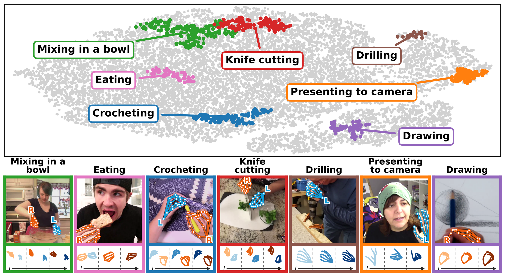
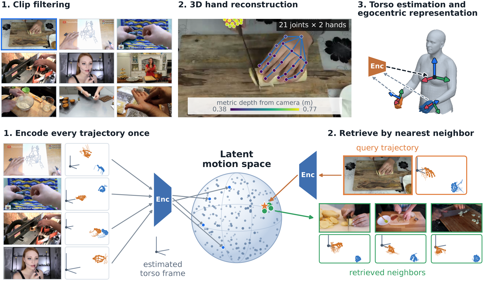
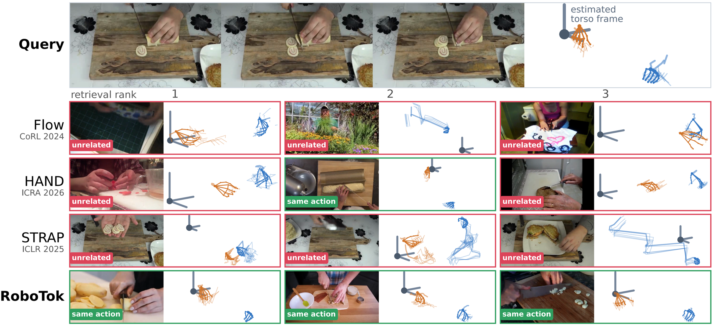
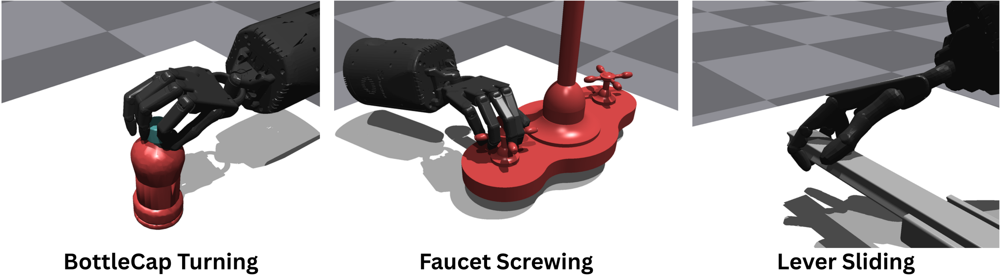

# 2026 RoboTok（arXiv）

# RoboTok: An Internet-Scale Data Engine for Human Demonstration Retrieval and Dexterous Manipulation Learning

**作者与机构**：Howard Qian、Yiting Chen、Yunfei Xie、Kejia Ren、Podshara Chanrungmaneekul、Gaotian Wang、Bowen Wen、Chen Wei、Kaiyu Hang；作者来自 **Rice University、NVIDIA**。

**发表信息**：2026 年 arXiv 预印本，arXiv:2609.03199。本文按当前预印本版本记录，不把排版模板视为正式录用信息。

**资料链接**：[项目主页](https://rice-robotpi-lab.github.io/RoboTok/) · [arXiv](https://arxiv.org/abs/2609.03199) · [代码](https://github.com/Rice-RobotPI-Lab/RoboTok-Code) · [数据与模型](https://huggingface.co/Rice-RobotPI-Lab/robotok-public) · [本地 PDF](../assets/papers/RoboTok.pdf)

# 1\. 研究意义

## a\. 研究背景：所描述的场景、背景

机器人学习需要覆盖大量任务、物体与环境的示范，但直接采集机器人数据成本很高，也很难覆盖真实世界中的长尾操作。与之相比，互联网视频持续产生切菜、搅拌、拧瓶盖、钻孔、编织等人类操作，其中包含大量潜在的动作监督。

真正困难的不是“网上有没有视频”，而是**怎样从海量、无结构的视频中找到与目标操作真正相关的示范**。同一种切割动作可能出现在不同厨房、视角与物体上；相反，两段画面都出现刀和砧板，也不代表手部动作相同。只看语义、场景或视觉外观，很容易检索到“看起来像”，但运动过程并不适合指导机器人的片段。

RoboTok 将这个问题改写为手部运动检索：先把视频转化为以人体躯干为参考系的三维手部轨迹，再学习一个紧凑的 latent motion space。给定一段人类 query video，系统通过向量近邻搜索找到手部运动相似的互联网示范，最后将这些示范用于灵巧手策略学习。



上图是 learned embedding 的 t-SNE 可视化。语义标签没有参与训练或检索，但搅拌、切割、钻孔、绘画等动作仍形成了较连贯的区域。这说明三维手轨迹中确实包含可用于区分操作行为的结构。不过，t-SNE 只是二维可视化，不能单独证明高维空间中的所有邻域都具有同样清晰的类别边界。

## b\. 问题及挑战：核心、重要、未解决的问题是什么

- **视觉相似不等于操作相似。** 背景、物体类别与动作语义可能相似，但手的运动方向、双手配合和操作节奏不同；反之，同一种动作也可能发生在完全不同的场景中。检索表示需要弱化外观，保留 manipulation motion。

- **相机坐标中的轨迹不可直接比较。** 同一个动作从正面、侧面或俯视拍摄，会产生不同的 camera-space trajectory。系统需要估计一个 actor-centered reference frame，尽量将相机视角变化从动作表示中分离出来。

- **视频时长和动作速度不同。** 两个人完成同一操作时，可能一个快、一个慢，阶段持续时间也不同。逐帧欧氏距离无法处理这种时间错位，因此需要允许局部拉伸与压缩的时序对齐。

- **精确轨迹比较难以扩展到大规模数据库。** Dynamic Time Warping（DTW）适合比较两条变长轨迹，却不适合在每次查询时与十万乃至更多视频逐一计算。需要将昂贵的轨迹距离蒸馏到可预计算、可索引的向量表示中。

- **检索质量必须落实到机器人学习。** 在自定义轨迹指标上得分高，并不自动说明数据对机器人有用。必须进一步验证检索结果能否改善下游策略的任务成功率。

# 2\. 研究现状

## a\. 领域的现状：针对上述问题及挑战，当前有哪些方法和技术

面向机器人示范检索，可以按主要匹配信号分为三类。

- **视觉或语义检索**使用图像特征、视觉语言模型或语言指令寻找相关视频。R+X、RfV 等工作说明互联网人类视频可以作为机器人经验来源，但语义相关只表示“可能在做同一类事”，未必保留具体手部运动。

- **图像空间的运动检索**显式利用时间信息。FlowRetrieval 比较 optical flow，HAND 比较二维人手路径与机器人末端路径，STRAP 对视觉特征序列做 subsequence DTW。这类方法比单帧外观更接近行为，却仍可能受视角、遮挡和图像尺度影响。

- **结构化三维轨迹检索**先恢复三维运动，再在统一参考系中比较。RoboTok 属于这一类：它使用最多两只手、每只手 21 个关节的三维轨迹，并转换到估计的躯干坐标系中，用 DTW 提供运动相似度监督。

与 SPOT、EgoInfinity 等从人类视频提取结构化运动的工作相比，RoboTok 的重点不是直接生成机器人动作，而是解决更前置的 **discovery and curation** 问题：在大规模网页视频中，哪些片段值得进入下游训练集？

## b\. 问题的现状：现有技术有哪些不足

语义与外观特征容易受到场景和物体类别主导；光流与二维路径虽然包含运动，却把相机运动、投影尺度和真实三维动作混在一起。直接使用 DTW 比较三维轨迹更接近问题定义，但每条 query 与整个库逐一对齐，计算成本会随数据规模快速增长。

RoboTok 的取舍是把感知与规范化放在检索之前，让轻量 encoder 主要学习 DTW 邻域结构。这降低了模型负担，也把系统瓶颈转移到了三维手部重建、深度估计和 torso frame estimation。换言之，**检索器变简单的前提，是上游已经提供可靠的结构化轨迹。**

# 3\. 技术路线

## a\. 问题与技术映射：针对上述问题，采用了哪些技术手段

| 问题 | RoboTok 的技术手段 |
| --- | --- |
| 网页视频无结构、质量差异大 | 筛选 4–8 秒、手部可见且相机近似静止的片段 |
| 只有 RGB 视频，没有可靠三维手轨迹 | WiLoR 手姿估计 + MoGe-2 metric depth + HaWoR 缺失轨迹补全 |
| 视角与演员位置不同 | 仅由 wrist-frame trajectory 估计静态 torso frame，并转成 actor-relative 3D trajectory |
| 动作速度与时序不同 | 使用 DTW 构造长度归一化的运动相似度 |
| 全库 DTW 查询不可扩展 | 用 DTW 邻域监督轻量 encoder，离线建立向量索引，在线做 cosine nearest-neighbor search |
| 检索指标未必代表机器人价值 | 将检索示范 retarget 为灵巧手状态，以奖励塑形指导 PPO，并比较任务成功率 |



## b\. 技术详述：对每个技术方法进行详细介绍

**数据处理：把网页片段变成 metric 3D hand trajectories。** RoboTok 从 Action100M 中处理已经初步筛选为人类活动的视频，再保留 4–8 秒、相机近似静止、手部具有一定可见性、每帧最多一只左手和一只右手的片段，并优先保留较长片段以去除重叠。最终语料库包含 100,000 条轨迹，其中 90,000 条用于训练检索器，10,000 条作为 held-out query。

系统以 5 fps 使用 WiLoR 估计三维手部关键点。由于 WiLoR 基于 weak-perspective camera model，所得深度不天然是 metric scale，RoboTok 再使用 MoGe-2 估计度量深度，将手部姿态转换到 metric camera coordinates；缺失手姿由 HaWoR 补全。每只手使用 21 个关节，因此一段双手视频最终对应一条变长的三维关节序列。

这条流水线比“从普通 RGB 视频直接得到可靠动作”更复杂：手检测、handedness linking、单目深度、遮挡补全中的误差都会进入最终轨迹。论文的贡献重点是检索表示与数据引擎，而不是证明上述感知模块在所有网页视频中都足够准确。

**躯干相对表示：将相机运动坐标改写为 actor-centered motion。** Camera-space trajectory 会随视角、拍摄距离和演员位置变化。RoboTok 训练一个轻量 torso-frame estimator，只输入手腕坐标系随时间的变化，预测演示者的静态躯干参考系；即使身体没有出现在画面中，也可以尝试恢复 actor-centered coordinates。该过程沿用并适配了 EgoInfinity 的 torso estimation 思路。

规范化后，检索比较的是手相对于人体如何运动，而不是手在图像中位于哪里。这能削弱相机视角差异，但并不等于完全的 viewpoint invariance：如果三维重建或 torso frame 本身估计错误，规范化也会错误；移动相机更是作者明确留给后续工作的场景。

**DTW 相似度：让相同动作允许不同速度。** 对长度分别为 \(L_i\) 与 \(L_j\) 的 21 关节手姿轨迹 \(x_i\)、\(x_j\)，DTW 在合法对齐路径 \(\pi\) 中寻找累计 pose distance 最小的路径：

\[
\operatorname{DTW}(x_i,x_j)
=
\min_{\pi \in \Pi}
\sum_{(t,u)\in\pi}\lVert x_i^t-x_j^u\rVert_2.
\]

论文进一步按两条轨迹的平均长度归一化，并取负数作为相似度：

\[
s(i,j)
=
-\frac{\operatorname{DTW}(x_i,x_j)}{\tfrac{1}{2}(L_i+L_j)}.
\]

这样，同一动作中较慢的准备阶段可以与另一视频中较短的准备阶段对齐。不过，DTW 只会在给定关节距离下寻找最佳时间对应，它不能自动理解物体、接触、任务阶段或因果关系。

**学习检索 embedding：把昂贵的 DTW 蒸馏为向量近邻。** 理想检索需要对 query 与整个数据库计算 DTW。RoboTok 改为学习映射 \(\Gamma(x)\)，将每条轨迹变成单位超球面上的 \(d\) 维向量，使 DTW 更相似的轨迹具有更高 inner product。

Encoder 对逐帧手姿加入 positional encoding，再用轻量 cross-attention pooling 得到 L2-normalized embedding。训练批次不是随机抽样，而是围绕 anchor 构造：从 DTW top-20 relevant set 中采两个 positive，再取一个刚好位于相关集合之外的 boundary negative；49 组组成 batch size 196。边界负样本比完全无关的随机负样本更能约束检索决策面。

目标函数为：

\[
\mathcal{L}=\mathcal{L}_{\mathrm{set}}+\lambda\mathcal{L}_{\mathrm{rank}}.
\]

Set loss 让 top-\(K\) 邻居排在边界与负样本之前，rank loss 则使正样本内部的相对顺序符合 DTW 排名。训练完成后，每条 corpus trajectory 只编码一次并存入 inner-product index；查询时只需编码 query，再做 cosine similarity search。新视频可以继续编码并加入索引，不必为每次扩库重新训练 encoder。



上图中，query 是刀具切割。Flow、HAND 和 STRAP 的部分结果在外观、局部运动或场景上与 query 接近，却没有稳定返回相同的手部操作；RoboTok 的前三项都表现出相似切割运动。该案例直观展示了 actor-relative 3D trajectory 的作用，但仍只是一个定性例子，不能替代全量检索指标。

**下游策略：检索视频通过 reward 引导 PPO，而不是直接提供 robot actions。** 论文先将人类手姿 retarget 到灵巧机器人手的状态空间，再将检索到的 demonstrations 构成状态库。策略从头使用 PPO 训练，输入只有 proprioception、fingertip force，以及长度为 3 的 observation window；展示 rollout 的相机画面不进入策略。

记 \(\Phi(s)\) 为当前 hand state 到 retargeted demonstration bank 的加权 \(k\)-NN 距离的负值。训练奖励既包含鼓励状态停留在示范流形附近的 \(\beta\Phi(s)\)，也包含 potential-based shaping：

\[
w\bigl(\gamma\Phi(s')-\Phi(s)\bigr).
\]

因此，实验验证的是“RoboTok 检索出的示范是否能构造更有用的策略引导”，不是“RoboTok 能否直接把 query video 翻译成机器人动作”。这一边界对理解论文非常重要。

## c\. 创新之处：最关键的技术是什么

我认为最关键的是**将 actor-relative 3D hand trajectory 作为互联网人类示范的检索键，并把 DTW 的精细时序相似度蒸馏到可扩展的向量空间中**。

三维手轨迹、DTW、metric learning 和 PPO reward shaping 都不是首次出现，创新在于围绕“从网页发现可用操作示范”把它们组织成完整数据引擎：

```text
互联网视频
  ↓
三维手姿恢复与躯干坐标规范化
  ↓
DTW 定义局部运动邻域
  ↓
轻量 encoder 学习可索引 embedding
  ↓
query video 检索相关示范
  ↓
retarget + reward shaping + robot policy learning
```

它把昂贵的 pairwise trajectory alignment 留在离线监督阶段，把在线查询压缩为一次编码和向量近邻搜索。相比固定收集一个数据集，RoboTok 更强调持续索引新网页视频的 data engine 视角。

# 4\. 实验分析

## a\. 实验数据：论文中使用了哪些实验数据

| 评测 | 数据与规模 | 评估目标 |
| --- | --- | --- |
| RoboTok retrieval corpus | 100,000 条 Action100M 片段；90,000 条训练，10,000 条 held-out query；检索库为除 query 外的其余片段 | 检查 learned embedding 是否复现 DTW top-20 邻域；公开代码说明划分单位是片段而非来源视频 |
| AssemblyHands | 831 条双手装配片段，使用 sensor-grade 3D hand annotations；每条依次作为 query | 检查跨数据集、较高质量三维手姿下的检索泛化 |
| 原始 VTDexManip | 6 项灵巧操作任务，seen／unseen object split | 与原 benchmark 和不同检索方法比较下游成功率 |
| 修改后的 HARDER VTDexManip | BottleCap Turning、Faucet Screwing、Lever Sliding；恢复自由三维手部运动并移除多项 dense reward | 在更依赖检索示范的设置中比较 PPO；每种方法 8 个 policy，每个物体 100 次尝试 |



论文同时报告 in-domain retrieval、out-of-domain retrieval 和 downstream policy performance，这比只展示检索可视化更完整。不过，真实机器人实验尚未给出，当前 downstream evidence 全部来自仿真灵巧手。

## b\. 对比实验：检索质量的数值变化

**RoboTok corpus：对 DTW pseudo-ground truth 的 top-20 检索。** 数值来自本地 PDF Table 2。

| 方法 | mAP@20 ↑ | nDCG@20 ↑ | CKNNA@20 ↑ | MRR@20 ↑ | Kendall \(\tau\) ↑ | DTW cost@20 ↓ |
| --- | ---: | ---: | ---: | ---: | ---: | ---: |
| Random | 0.0000 | 0.0001 | 0.0000 | 0.0005 | 0.0000 | 4.776 |
| Flow | 0.0004 | 0.0017 | 0.0007 | 0.0045 | 0.0031 | 6.612 |
| HAND | 0.0009 | 0.0040 | 0.0024 | 0.0122 | 0.0118 | 4.528 |
| STRAP | 0.0071 | 0.0257 | 0.0217 | 0.0824 | 0.0137 | 4.044 |
| **RoboTok** | **0.3531** | **0.5836** | **0.4853** | **0.8576** | **0.4867** | **1.333** |
| GT DTW upper bound | 1.000 | 1.000 | 1.000 | 1.000 | 1.000 | 1.145 |

RoboTok 的 Recall@20 为 0.996，表示几乎每个 query 的前 20 个返回结果中都至少出现一个 DTW true neighbor。其 top-20 平均 DTW cost 为 1.333 m，距 oracle neighbor 的 1.145 m 高约 16%，显著低于 Random 的 4.776 m。

这些数字证明 encoder 很好地拟合了 DTW 定义的邻域，但需要注意：训练监督与评估相关集合都来自同一个 DTW oracle，因此这部分实验主要验证“embedding 能否近似 DTW”，而不是独立的人类语义相关性判断。

**AssemblyHands：跨数据集检索。** 数值来自 Table 3，relevant set 为 DTW top-5。

| 方法 | mAP@5 ↑ | nDCG@5 ↑ | CKNNA@5 ↑ | MRR@5 ↑ | Kendall \(\tau\) ↑ | DTW cost@5 ↓ |
| --- | ---: | ---: | ---: | ---: | ---: | ---: |
| Random | 0.0025 | 0.0042 | -0.0010 | 0.0126 | 0.0062 | 1.911 |
| Flow | 0.0131 | 0.0263 | 0.0176 | 0.0588 | 0.0897 | 1.850 |
| HAND | 0.0214 | 0.0427 | 0.0256 | 0.0964 | 0.0799 | 1.830 |
| STRAP | 0.1330 | 0.2293 | 0.1812 | 0.3968 | 0.1569 | 1.304 |
| **RoboTok** | **0.2614** | **0.3868** | **0.3358** | **0.6215** | **0.2679** | **1.095** |
| GT DTW upper bound | 1.000 | 1.000 | 1.000 | 1.000 | 1.000 | 0.966 |

RoboTok 在外部数据集的每项指标上仍领先，mAP@5 约为 STRAP 的 1.97 倍，说明 learned motion space 不只记住 Action100M 的具体样本。不过，AssemblyHands 的“相关性真值”仍由同一 DTW 规则产生；sensor-grade annotation 提高的是轨迹质量，不会消除评价定义与训练目标之间的关联。

## c\. 下游机器人策略：检索结果是否真的有用

**原始 VTDexManip 已接近饱和。** RoboTok-guided policy 在六个任务中的五个取得最高成功率；作者按六项任务平均后，报告其相对最佳已发表 baseline 在 seen objects 上高 7.45 个百分点，在 unseen objects 上高 5.83 个百分点。

但并非所有任务都领先：Table Reorientation 的 seen／unseen 结果分别为 82.6%／76.2%，低于 VT-JointPretrain 的 85.0%／84.6%；Bimanual Hand-over 的 unseen 成功率为 34.8%，低于 Random retrieval 的 42.1%。因此，结论应是整体平均更强，而不是所有任务都由 motion retrieval 获益。

**HARDER setting 更能体现检索差异。** 下表将 RoboTok 与每行最强的其他 retrieval-guided 方法比较，单位为成功率 %。

| 任务 | Split | 最强其他检索方法 | RoboTok | 提升 |
| --- | --- | ---: | ---: | ---: |
| BottleCap Turning | Seen | 59.5（HAND） | **77.3** | +17.8 |
| BottleCap Turning | Unseen | 27.0（HAND） | **38.1** | +11.1 |
| Faucet Screwing | Seen | 6.8（HAND） | **44.8** | +38.0 |
| Faucet Screwing | Unseen | 2.6（HAND） | **10.9** | +8.3 |
| Lever Sliding | Seen | 19.5（HAND） | **79.3** | +59.8 |
| Lever Sliding | Unseen | 25.2（HAND） | **58.3** | +33.1 |

在自由三维运动、较少人工 dense reward 的设置中，BottleCap Turning 与 Lever Sliding 的提升较明显，符合这些任务依赖手腕路径、手指形态和阶段性接近方式的判断。Faucet Screwing 的 unseen 成功率虽然仍为最高，但只有 10.9%，说明检索示范改善了探索方向，却没有解决新物体上的全部控制难题。

## d\. 消融实验：证据还缺什么

**当前论文没有对核心模块做完整的独立消融。** 对比实验整体替换了检索方法，能够说明最终 retrieval pipeline 有用，却没有隔离每个设计的贡献。

| 需要验证的设计 | 当前证据边界 | 建议补充的对照，非论文已有结果 |
| --- | --- | --- |
| Torso-relative coordinates | 有跨数据集结果与定性案例，无 camera-frame 对照 | Camera frame、root-relative hand frame、estimated torso frame |
| Metric 3D hand pose | 与 2D／visual baselines 比较时，上游与 encoder 同时变化 | 固定 encoder 与训练目标，仅替换 2D、relative 3D、metric 3D 输入 |
| Set loss + rank loss | 无单独 loss ablation | 仅 set、仅 rank、二者组合 |
| Boundary negatives | 无随机负样本对照 | Random negatives、semi-hard negatives、boundary negatives |
| DTW supervision | 检索评价也以 DTW 为真值 | 人工行为相关标注、task label、下游成功率驱动的 relevance |
| 检索数量与数据规模 | 主要采用固定 top-\(K\) 设置 | 不同 \(K\)、不同 corpus size 和数据质量曲线 |

因此，不能把 downstream 提升单独归因于 torso frame、DTW、cross-attention 或某个 loss。现有实验支持的是整套系统相对所选 baselines 的有效性。

## e\. 实验总结

- **对技术方法的重新认识：** 数据检索不是简单的预处理。选择哪些示范会改变策略看到的运动先验，并在 sparse-reward setting 中显著影响探索与最终成功率。

- **最有说服力的证据：** 不只是 DTW retrieval metric，而是 HARDER VTDexManip 中不同检索方法在完全相同 PPO 框架下产生明显成功率差异。论文声明没有使用 robot demonstrations 或 action labels，因此这些差异主要来自 retrieved clips。

- **仍需谨慎的地方：** retrieval benchmark 的 ground truth 与训练 oracle 同源，真实机器人结果缺失，且 downstream 只覆盖仿真 anthropomorphic hand。当前证据说明 motion-aware retrieval 有潜力，但还不足以证明网页视频数据引擎已经解决真实部署的数据瓶颈。

# 5\. 不足之处

1. **检索评估与训练目标共享 DTW 定义。** RoboTok 用 DTW 生成 positives、ranking 与 boundary negatives，又用 DTW top-\(K\) 定义测试 relevant set。高 mAP 可靠地说明模型近似了 teacher metric，却不能独立证明结果最符合人类对任务相关性的判断。AssemblyHands 使用更可靠的三维手姿，但 relevance 仍由 DTW 定义。此外，[公开代码说明](https://github.com/Rice-RobotPI-Lab/RoboTok-Code)训练与评估采用片段级随机划分，并非按来源视频划分；同一来源视频的其他片段可能跨越两组。后续应补充按来源视频划分、人工标注和 task success 驱动的相关性测试。

2. **真实机器人证据缺失。** 当前策略评测全部来自 VTDexManip 仿真，项目页的 real-world tasks/results 仍标为 coming soon。人手轨迹 retarget 到真实灵巧手后会遇到关节极限、接触摩擦、标定误差、执行延迟和安全约束，这些都没有被现有结果覆盖。

3. **只检索手部运动，可能忽略决定任务成败的物体与接触信息。** 相同手轨迹作用于不同形状、尺度或关节结构的物体，效果可能不同；仅靠关节位置也无法表达接触力、滑移与材质。可以把 RoboTok 的 motion embedding 与 object pose、contact state、hand-object graph 或视觉语义联合使用，而不是完全回到外观检索。

4. **“互联网视频”仍有较强输入筛选条件。** 论文只保留 4–8 秒、相机近似静止、手部可见且每侧最多一只手的片段，作者也将 moving-camera third-person／egocentric video 留作未来工作。复杂剪辑、长时任务、多人协作和严重遮挡仍在适用范围之外。

5. **上游感知误差会被规范化与检索继续放大。** WiLoR、MoGe-2、HaWoR 和 torso estimator 串联后，错误的 handedness、metric depth 或 actor frame 都可能让相同动作被分开，或让无关动作靠近。论文缺少基于 sensor ground truth 的模块级噪声敏感性实验。

6. **“Internet-scale”更多是架构目标，而不是已经验证的无限扩展能力。** 当前 corpus 为 100,000 条片段，已经足以检验向量索引相对全库 DTW 的必要性，但距离开放互联网的规模、分布漂移、重复内容和长期增量维护仍有距离。新片段可以直接加入现有 index，不代表 encoder 面对全新动作分布时永远不需更新。

# **6\. 基于本文扩展到的其他论文**

1. [EgoInfinity: A Web-Scale 4D Hand-Object Interaction Data Engine for Any-View Robot Retargeting and Video-to-Action Robot Learning](egoinfinity.md)，2026。

    1. RoboTok 的 torso-frame estimation 沿用了 EgoInfinity 的思路，但两者目标不同：EgoInfinity 强调从野外视频恢复 metric 4D hand-object interaction 并支持 retargeting，RoboTok 强调用 actor-relative hand trajectory 建立可扩展检索索引。

    2. 可以把 EgoInfinity 更丰富的 hand-object representation 用作 RoboTok 的检索键，测试 object motion、contact 与 hand motion 的组合是否能减少“手势相似但物理任务不同”的误检。

2. [SPOT: SE\(3\) Pose Trajectory Diffusion for Object-Centric Manipulation](spot.md)，ICRA 2025。

    1. SPOT 以目标相对的 object pose trajectory 连接人类演示与机器人执行，RoboTok 则用 torso-relative hand pose trajectory 解决互联网示范发现。前者更接近任务物体运动，后者更适合描述灵巧手形态与双手协同。

    2. 一个自然组合是先用 RoboTok 从互联网找到手部运动相似的视频，再用 SPOT 式 object-centric trajectory 过滤或组织执行目标，使 retrieval 与 control 使用互补表示。

3. [ReWeight: Leveraging Human Data for VLA Post-Training via Demonstration Retrieval and Sample Weighting](https://arxiv.org/abs/2609.13851)，2026。

    1. ReWeight 同样反对将所有 human demonstrations 等量混入训练，但它依据目标机器人数据进行 demonstration retrieval 与 sample weighting，用于 VLA post-training；RoboTok 则在人体运动空间中检索，再用结果引导灵巧手 PPO。

    2. 可以进一步研究两阶段选择：先用 RoboTok 从网页库中做 motion-aware coarse retrieval，再用 ReWeight 式 robot-conditioned discrepancy 对候选样本重新加权。

4. [HAND Me the Data: Fast Robot Adaptation via Hand Path Retrieval](https://liralab.usc.edu/handretrieval/)，ICRA 2026。

    1. HAND 先按视觉相似性过滤 self-collected robot play，再匹配二维相对手路径与机器人末端路径；RoboTok 则直接索引 internet human video，并比较 torso-relative 3D hand joint trajectories。

    2. HAND 在部分 VTDexManip 任务上是最强 retrieval baseline，也提醒我们不能只比较表示精细程度，还应控制数据来源、机器人 embodiment 与下游 reward construction。
