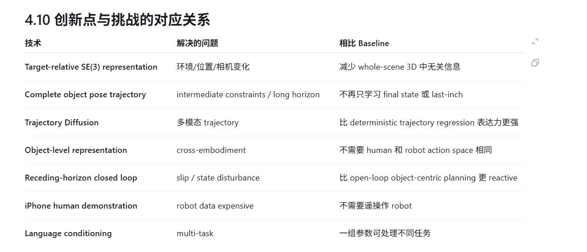

# SPOT：概念与阅读随记

### 专业词汇
- prehensile manipulation：抓握操作。机器人先抓住物体，再通过抓持来操纵物体，比如抓起杯子再移动。关键在于物体和夹爪之间建立了稳定接触，相对的操作是non-prehensile manipulation，通过推、拨、滑等方式操纵。
- cross-embodiment learning：跨机器人学习。用多种不同机器人本体（单臂、双臂）的数据共同训练一个模型，希望学到可迁移、可泛化的机器人能力，难点是不同机器人的action space不一样，目标是实现一个模型不只控制一种机器人。
- 6D pose：可以理解为6个自由度，三个位置自由度，即x,y,z；三个旋转自由度，绕轴转多少度
- embodiment-agnostic：具身-不可知。简单理解就是不与机器人强绑定，不需要一个对应机器人的demonstration，可以直接利用人类或者其他机器人的数据学习物体应该沿什么3D pose trajectory运动。
- DDPM/DDIM：两者都是用来推理的，使用前已经进行好了diffusion policy的训练，区别是DDPM一般从50一步步减到0；DDIM可以跳步，比如100-80-60-40-20-0，因为开始的时候diffusion policy已经大致预测了最终状态以及噪声，只是存在一些误差，所以可以跳过一些中间状态加速推理过程。
### 挑战
- 既要精确描述任务相关的 3D 几何关系，又不能携带太多无关场景信息；同时还要表达完整过程约束，并跨 embodiment 泛化。
- 不能携带太多无关场景信息，因为模型会在完全无关的环境进行测试，学习到场景信息会影响到模型的泛化能力。
- 跨embodiment泛化，指的是人体与机械臂之间的区别，机械臂从人体持iPhone拍摄的demonstration进行学习。

### 创新点
之前的方法可能只能着重于最后一部分关键操作，对于中间态的处理比较忽略；SPOT方法构建了整个object pose trajectories，从物体初始状态到最后的完成状态进行建模，对于处理倒水这种需要水壶保持直立等约束强的任务处理较好。

[继续阅读 SPOT 深度笔记](spot.md)
