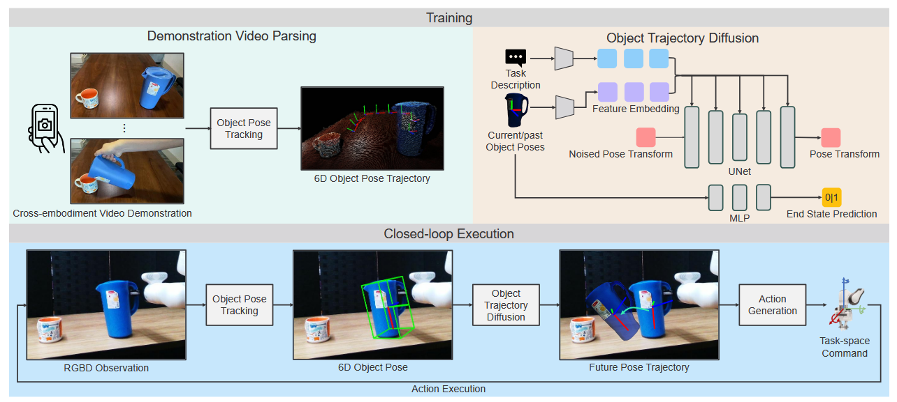
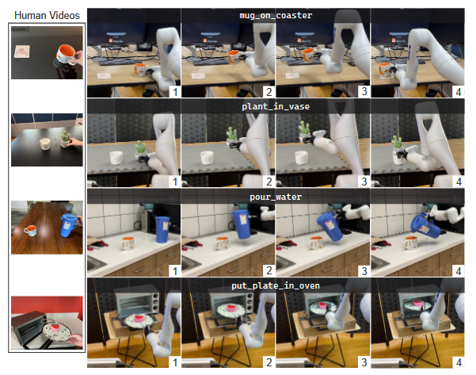
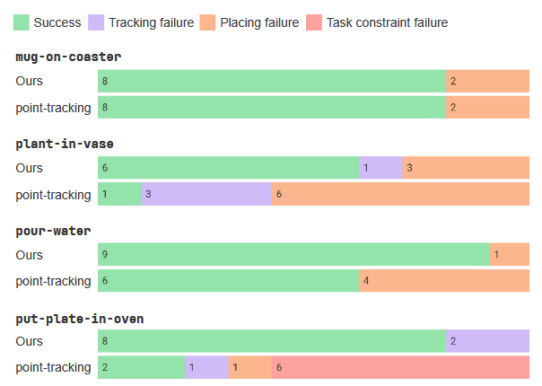

# 2025 SPOT \(ICRA\)

# SPOT: SE\(3\) Pose Trajectory Diffusion for Object\-Centric Manipulation

**作者与机构**：Cheng\-Chun Hsu、Bowen Wen、Jie Xu、Yashraj Narang、Xiaolong Wang、Yuke Zhu、Joydeep Biswas、Stan Birchfield；作者来自 **NVIDIA、University of Texas at Austin、UC San Diego** 等机构。

**发表信息**：**ICRA 2025**；论文最初以 arXiv:2411\.00965 发布，后续更新版本发表于 2025 年。

# 1\. 研究意义

## a\. 研究背景：所描述的场景、背景

SPOT 研究如何从少量人类演示中学习刚性物体的机器人操作。以倒水为例，人用手拿起水壶，移动到杯子附近后倾斜；机器人需要从视频中学会完成相同任务。但视频没有机器人的动作标签，人的手部结构、抓持方式和运动范围也与机械臂不同，直接复制人的动作并不自然。

两者共同的任务信息是“水壶相对于杯子应该怎样运动”。SPOT 因而提取物体的位置和朝向，以目标物体坐标系中的 SE\(3\) 位姿轨迹连接人类演示与机器人执行。系统根据 RGB\-D 观测估计物体状态，预测未来物体运动，再转换为机器人末端动作。多任务设置使用语言描述指定任务。

这类任务不仅要求终点正确，也要求过程正确。把装有食物的盘子送进烤箱，需要沿途保持盘面朝上；倒水需要搬运时保持直立，到杯口附近再倾斜。**完整轨迹能够保留这些中间要求，而单个目标位姿无法充分描述操作过程。**

## b\. 问题及挑战：核心、重要、未解决的问题是什么

- **人类 actionless 演示与机器人执行之间存在 embodiment 与视觉域差异。** 人类视频不包含机器人的动作标签，人的手与机械臂在结构、抓持方式和动作空间上也不同，不能直接把手部运动作为机器人控制命令。演示端与机器人部署端还存在相机、视角、背景、操作者、光照等视觉域差异：论文使用 iPhone 采集人类 RGB\-D 演示，部署端使用 RealSense D415，且两端环境不重合。因此，需要提取与具体操作者和视觉外观相对解耦、又能指导机器人执行的任务信息，这是 SPOT 采用物体位姿轨迹作为中间表示的主要动机之一。

- **任务不仅要求终点正确，还存在需要在操作过程中满足的中间约束。** 只描述最终目标位姿，无法充分规定物体应如何到达目标；只关注最后一段精细对齐，也可能需要额外手工设计前面的搬运规则。例如，搬运装有食物的盘子时需要保持水平，倒水时需要先将水壶搬到杯口附近，再按任务需要倾斜。SPOT 因而试图从完整物体位姿轨迹中学习中间运动要求，而不只建模 final pose 或 last\-inch manipulation。

- **真实执行存在状态偏差，需要根据最新观测进行闭环修正。** 操作过程中可能发生物体滑动、抓持关系变化或执行误差，使实际物体状态偏离最初规划。若一直按初始轨迹开环执行，控制器无法及时利用这些变化，偏差可能持续或累积。因此，需要持续重新观测物体位姿，以最新状态更新后续轨迹。这是 SPOT 将物体跟踪与滚动时域执行结合的研究动机。

# 2\. 研究现状

## a\. 领域的现状：针对上述问题及挑战，当前有哪些方法和技术，着重一个技术分类

按照策略依赖的表示，可以分为三类。

- **原始视觉到动作的方法**直接根据图像和机器人状态回归或生成动作，Diffusion Policy 是其中的生成式路线，通过条件去噪生成未来动作序列。它适合表达多种合理行为，但标准训练仍需要机器人动作监督。

- **全场景三维方法**显式利用空间信息。PerAct 使用体素，RVT 系列使用三维场景的虚拟视角，3D\-DA 结合三维场景表示和动作扩散。这些方法保留环境信息较多，但也需要从复杂场景中学出任务相关关系。SPOT 的仿真基线 RVT\-2 属于这一类，它与示例笔记中的 RDT2 是不同方法。

- **物体中心方法**先提取物体、关键点、点轨迹或六维位姿，再构造操作策略。视频模仿中的点跟踪路线也属于这种思路。SPOT 选择目标相对的刚体位姿序列，同时表达平移、旋转及其中间变化。视频是数据来源，物体位姿是表示，扩散是生成方式，三者并非互斥的技术类别。

## b\. 问题的现状：针对以上技术，这些技术有哪些不足之处

直接学习机器人动作时，监督信号与硬件相关，人类视频难以提供对应标签；全场景表示虽然完整，却包含大量与当前任务无关的信息，少量演示下学习负担较大。物体中心方法降低了这种负担，但如果只预测终点或最后一段对齐动作，前面的搬运过程仍可能依赖人工规则。

点轨迹能表达运动，却会受到跟踪噪声、遮挡和点对应错误影响，由此恢复的刚体变换也可能不准确。此外，即使规划正确，物体在夹爪中滑动后，原来的物体—末端关系也可能失效。SPOT 因而结合直接位姿估计、完整轨迹学习和在线反馈。不过，结构化表示会舍弃部分场景信息，这也形成了后续适用性边界。

# 3\. 技术路线

## a\. 问题与技术映射：针对上述问题，采用了哪些技术手段

针对动作标签缺失，SPOT 从视频中提取物体轨迹，让模型学习任务几何，再由执行端生成机器人动作。针对绝对空间配置和坐标系变化，将源物体位姿转换到目标物体坐标系，使模型主要学习 source\-target relative geometry，而不是 world/camera coordinate 中的绝对位置，不同相机条件下的视觉鲁棒性仍依赖 FoundationPose 等感知模块。针对中间约束，学习未来一段位姿序列，并通过关键帧筛选减少冗余和抖动。针对执行偏差，采用滚动时域控制，执行部分轨迹后重新观测；终止分类器与任务阶段条件分别处理结束判断和阶段切换。

## b\. 技术详述：对每个技术方法进行详细介绍

**目标相对位姿：先把不同演示放到共同坐标系。** 每个阶段包含源物体和目标物体，倒水时分别为水壶和杯子。SE\(3\) 同时描述三维平移与旋转，因此既记录水壶在哪里，也记录朝向哪里。记 ${}^{A}T_{B}$ 为从 B 到 A 的坐标变换，C、S、G 分别代表相机、源物体和目标物体，则：

${}^{G}T_S=({}^{C}T_G)^{-1}{}^{C}T_S.$

杯子移到桌面另一处后，水壶在相机坐标系中的位置会变化，但“壶嘴接近杯口”的相对关系可以保持一致。这有助于不同演示共享任务结构。不过，相对坐标不能自动解决新物体形状、重力方向和障碍物变化，也不等于网络具有经过证明的 SE\(3\) 等变结构。

位姿跟踪采用 FoundationPose。SPOT 的实现需要 RGB\-D、物体三维模型和首帧定位信息：真实设置使用 iPhone 扫描与 YOLO\-World 物体框，仿真设置使用 BundleSDF 重建与 SAM\-6D 掩码。随后在相对速度为零，或相对上一个关键帧的平移、旋转超过阈值时保留关键帧，以减少密集演示中的冗余与噪声。因此，系统不能简单概括为“普通 RGB 视频直接输入策略”。

**轨迹扩散：根据当前状态生成未来过程。** 模型条件为当前相对位姿，以及观察窗口允许时的历史位姿；输出为未来物体位姿轨迹。训练时对演示轨迹的数值表示加噪，网络根据条件和扩散时间步预测噪声，以均方误差训练。推理时从随机噪声逐步去噪，得到合理轨迹。

位姿通过三层 MLP 等结构编码为 64 维特征，UNet 负责轨迹去噪；多任务描述由 CLIP 编码后与位姿条件结合。论文采用 DDIM，训练噪声时间步数为 100，推理去噪步数为 10，这不是机器人轨迹的长度。训练并没有额外设置“水不能洒”的约束损失，中间要求通过成功演示中的位姿变化间接学习。因此，符合示范模式不等于具有普遍的约束保证。

以倒水为例，关键不是看到水壶最后倾斜就直接预测一个倾斜姿态，而是结合当前水壶与杯子的关系，生成包含搬运、接近和转动的后续序列。历史位姿在观察窗口允许时补充运动信息，但论文没有系统比较不同历史长度，不能据此认为任意阶段歧义都已解决。Diffusion 从建模能力上可以表达 multimodal trajectory distribution，但 SPOT 本文没有提供 diffusion vs deterministic regression 的独立消融，因此不能把系统性能提升直接归因于 diffusion。

**动作转换：物体目标需要结合实际抓持关系。** 系统利用相机外参、当前末端与物体位姿，估计物体相对末端的关系，再把预测物体位姿转换为末端子目标。抓住壶柄不同位置时，同一个水壶目标对应的末端姿态不同，但任务轨迹可以共用。这里得到的是末端目标，仍需机器人执行端跟随，不能保证任意轨迹都满足可达性、碰撞或动力学要求。仿真初始抓取使用从演示得到的预生成位姿，本文重点是抓取后的运动。

**闭环与阶段切换：预测一段，只执行其中一部分。** 每轮预测未来 N 步，选择 K 步执行，再根据最新物体状态规划。这样能够对物体滑动等偏差作出反馈。独立 MLP 根据当前位姿判断终态，以二元交叉熵训练，预测超过 0\.95 时触发夹爪打开。多阶段任务利用演示中的夹爪开合划分阶段，加入阶段编码，并由终态预测触发切换。这依赖已有阶段结构，不能等同于开放式长任务的自主分解或长期记忆。

## c\. 创新之处：你认为的上述方法中，最关键的技术是什么

我认为核心是**以目标相对的完整物体轨迹作为学习与执行的接口**：相对坐标突出任务关系，轨迹保留过程要求，执行端再适配抓持方式。扩散、位姿估计和闭环控制均有前序研究，价值在于围绕这一表示组织完整系统。

它适合物体可稳定跟踪、任务主要由刚体相对运动描述的搬运、放置和部分插入操作。可借鉴的思想是先明确任务需要保留什么，再选择学习表示。布料形变、快速动态操作和力控任务则需要补充状态，不能直接沿用同样的简化。

# 4\. 实验分析

## a\. 实验数据：论文中使用了哪些实验数据

仿真使用 RLBench／CoppeliaSim 和 Franka Panda，选择 13 项任务，各任务含 2–60 种变体；采用每任务 100 条演示和 25 个未见配置的设置。真实实验使用 Kinova Gen3 与经过外参标定的 RealSense D415。演示场景与测试场景不重合。

|评测|数据与测试规模|比较时需要注意|
|---|---|---|
|仿真|13 项任务，100 条演示／任务，25 个未见配置／任务|SPOT、3D\-DA 单相机；RVT\-2 四相机|
|真实|4 项任务，8 条人类演示／任务，10 次测试／方法／任务|使用相同机器人硬件，不能当作多型号机器人验证|

SPOT 还使用物体模型、位姿跟踪和抓取支持，比较不只是网络本身的差异。真实结果区分成功、跟踪失败、放置失败和任务约束失败；其中任务约束失败指执行过程中违反任务要求的中间运动约束，例如盘子未持续保持正确姿态。仿真表中的“±”项在上传版本中未清楚解释统计口径，下表仅列均值，不据此判断显著性。

## b\. 对比实验：与其他算法对比，突出数值的变化

**仿真：平均优势集中在精细操作和多阶段任务。** 单位为成功率 %，数据来自 Table I。

|任务|RVT\-2|3D\-DA|SPOT|
|---|---|---|---|
|13 项平均|76\.4|54\.5|79\.4|
|Insert Peg|44\.0|9\.3|78\.7|
|Place Cups|33\.3|4\.0|62\.7|
|Stack Blocks|81\.3|41\.7|94\.0|
|Stack Cups|60\.0|30\.7|96\.0|
|Drag Stick|98\.7|92\.0|80\.0|
|Screw Bulb|86\.7|38\.7|48\.0|
|Sort Shape|49\.3|30\.7|32\.0|

SPOT 平均比 3D\-DA 高 24\.9 个百分点，比 RVT\-2 高 3\.0 个百分点。Insert Peg 与 Place Cups 相对 3D\-DA 分别提高 69\.4、58\.7 个百分点，支持显式物体几何有利于这些精细任务的判断。Stack Cups 达到 96\.0%，说明阶段化轨迹可以有效组织连续操作，但不代表已解决分钟级家务中的规划和记忆问题。

这里更值得关注的是任务之间的差异，而非只看平均值。精细插入的明显收益与作者的表示动机一致；细长物体上的退步则提醒我们，策略端减少输入复杂度的前提，是感知端能够可靠提取状态。两类结果共同说明适用范围，比笼统概括为“物体中心方法更好”更有价值。

弱项也很明确：SPOT 在 Drag Stick、Screw Bulb、Sort Shape 均低于 RVT\-2。作者联系到细长物体、小物体被夹爪遮挡和不同对称性带来的困难。因此，论文展示的是所选任务集合的平均优势，并非所有任务都优于基线。由于感知、表示和执行同时不同，收益也不能全部归因于扩散。

**真实实验：区分成功率与过程约束。** 基线由作者实现，使用 CoTracker 跟踪采样点，再以 RANSAC 恢复变换进行轨迹学习，并非对所有视频模仿完整系统的统一比较。

|任务|点跟踪成功率|SPOT 成功率|提升|
|---|---|---|---|
|杯子放杯垫|80%|80%|0 个百分点|
|仙人掌插花瓶|10%|60%|50 个百分点|
|倒水|60%|90%|30 个百分点|
|盘子放烤箱|20%|80%|60 个百分点|
|合并 40 次测试|42\.5%|77\.5%|35 个百分点|

最后一行按 Figure 4 次数计算：SPOT 成功 31/40 次，基线 17/40 次，并非论文单独报告的指标。杯垫任务没有收益，说明简单放置未必需要更复杂的位姿表示；花瓶差距较大，符合精细对齐对轨迹误差敏感的解释。失败次数如下，每行均来自 10 次测试。

|任务|方法|跟踪失败|放置失败|约束失败|
|---|---|---|---|---|
|杯垫|SPOT／点跟踪|0／0|2／2|0／0|
|花瓶|SPOT／点跟踪|1／3|3／6|0／0|
|倒水|SPOT／点跟踪|0／0|1／4|0／0|
|烤箱|SPOT／点跟踪|2／1|0／1|0／6|

烤箱任务最直接支持过程约束的动机：基线 6 次约束失败，SPOT 为 0 次，但后者仍有 2 次跟踪失败。倒水的失败均被归为放置失败，不能把其提升全部解释成减少洒水。每任务只有 10 次测试，一次成败就是 10 个百分点，应结合失败类型解读。

## c\. 消融实验：与自己对比，突出数值的变化

**论文没有独立模块消融。** 点跟踪基线最接近表示替换比较，它支持轨迹提取质量的重要性，但没有分别隔离相对坐标、关键帧、扩散和闭环的贡献。

|需要验证的设计|原文证据边界|建议补充的对照，非已有结果|
|---|---|---|
|位姿轨迹提取|有点跟踪基线比较|控制其他模块，仅改变轨迹来源|
|目标相对坐标|无独立消融|相对坐标与绝对坐标|
|关键帧|无独立消融|关键帧和全部帧|
|完整轨迹与扩散|无独立消融|完整轨迹与仅终点；扩散与直接回归|
|闭环反馈|有机制描述，无受控收益分析|开环与不同反馈频率，加入可控扰动|

因此不能补写“去掉某模块下降多少”，也不能把系统成功直接当作每项创新均已验证。

## d\. 实验总结

- **对技术方法的重新认识：** SPOT 的数据效率建立在高质量结构化感知之上。物体可稳定跟踪时，紧凑的相对轨迹突出精细关系和过程要求；细小、遮挡或对称物体则暴露出入口瓶颈。表示简单，并不意味着获得该表示也简单。

- **可借鉴之处：** 先识别任务中的必要关系，再决定学习什么，比直接扩大网络更值得在少样本场景尝试。评测也应对应动机：过程约束看约束失败，闭环恢复看受控扰动，数据效率看演示数量曲线。现有实验支持系统可行，但尚未完整分解收益来源。

结合 FISH ，可以进一步考虑用在线残差控制修正物体轨迹执行中的接触误差。不过，残差不能天然补救错误的任务轨迹或持续失真的感知。这属于可探索的组合方向，不能写成 SPOT 已具备的在线学习能力。

# 5\. 不足之处

1. **闭环修正依赖可靠的位姿跟踪，感知错误仍可能使 SPOT 失效。**位姿既是训练监督，又是在线状态，还参与动作转换，错误会影响整个链路。原文 Figure 4 中，SPOT 在烤箱任务的 10 次测试中有 2 次因跟踪丢失而终止，花瓶任务也有 1 次跟踪失败。这说明，即使引入闭环反馈，失去有效观测后也不能保证继续完成任务。物体模型和标定还增加了准备成本。我认为应让置信度参与控制，低置信度时重定位或调整观察，而非继续沿错误状态执行；这些方案需要额外验证。

2. **SE\(3\) 轨迹不能完整表达物理交互。** 相同空间路径采用不同速度或接触力，可能导致完全不同结果。论文也承认对非抓持、动态和可变形物体任务的限制。两物体相对关系还可能遗漏障碍物和机器人可达性。更合理的扩展是保留轨迹作为高层目标，加入环境几何、接触或力反馈的低层控制。

3. **泛化与机制证据仍有限。** 真实实验只有四项任务和一种机器人硬件，跨本体主要指人类演示到Kinova，不能称已验证多种未见机器人。仿真任务经过筛选，且缺少模块消融。后续应控制抓取支持、相机数量和感知质量，增加物体与本体变化，并独立测试关键设计，才能判断哪些收益可迁移。

# **6\. 基于本文扩展到的其他论文**

1. [ORION: Vision\-based Manipulation from Single Human Video with Open\-World Object Graphs](https://link.springer.com/article/10.1007/s10514-026-10253-8)，2026，Autonomous Robots。

    1. ORION 同样研究从人类视频学习机器人操作，但将 SPOT 较紧凑的 SE\(3\) 轨迹进一步扩展为 Open\-World Object Graph，显式表示物体、抓取点和空间关系，并支持从单条人类视频学习。

    2. 可以进一步思考：SPOT 的 SE\(3\) representation 是否过于压缩，能否引入 Object Graph，在保持 object\-centric 泛化能力的同时表达更丰富的局部几何和抓取信息。

2. [Human2Sim2Robot: Crossing the Human\-Robot Embodiment Gap with Sim\-to\-Real RL using One Human Demonstration](https://human2sim2robot.github.io/)，2025，CoRL。

    1. 从单条 Human RGB\-D demonstration 中提取 object pose trajectory，并将其转化为 embodiment\-agnostic reward，在 Simulation 中通过 RL 学习适合目标机器人的动作，再进行 Sim\-to\-Real。

    2. 与 SPOT 的区别在于：SPOT 将 Object Trajectory 作为 Policy 的中间表示，而 Human2Sim2Robot 将其作为 RL Reward。可以进一步研究两种利用方式如何结合。

3. [X\-Sim: Cross\-Embodiment Learning via Real\-to\-Sim\-to\-Real](https://portal.cs.cornell.edu/X-Sim/)，2025，CoRL。

    1. X\-Sim 从 Human RGB\-D Video 重建仿真环境，并利用 Object Motion 构造 Reward，通过 Simulation RL 生成大量机器人轨迹，再训练 Image\-conditioned Diffusion Policy，不需要机器人遥操作数据。

    2. SPOT 强调“少量数据 \+ 强 Object Representation”，X\-Sim 更强调“Human Data → Simulation → Synthetic Data Scaling”，可以结合两者探索更低成本的大规模机器人数据生成。
